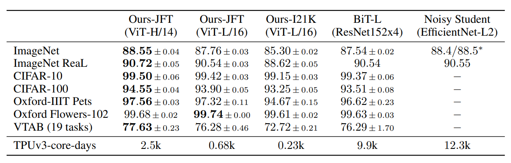

# Vision Transformer for PyTorch

This directory provides a script and recipe to train the Vision Transformer model to achieve state of the art accuracy, and is tested and maintained by Intel® Gaudi®. For further information on performance, refer to [Intel Gaudi Model Performance Data page](https://developer.habana.ai/resources/habana-training-models/#performance). Before you get started, make sure to review the [Supported Configurations](#supported-configurations).

For further information on training deep learning models using Intel Gaudi AI accelerator, refer to [developer.habana.ai](https://developer.habana.ai/resources/).

## Table of Contents
  - [Model-References](../../../../README.md)
  - [Model Overview](#model-overview)
  - [Setup](#setup)
  - [Training Examples](#training-examples)
  - [Supported Configurations](#supported-configurations)
  - [Changelog](#changelog)
  - [Known Issues](#known-issues)

## Model Overview

This is a PyTorch implementation of the Vision Transformer model described in [An Image is Worth 16x16 Words: Transformers for Image Recognition at Scale paper](https://arxiv.org/abs/2010.11929). It is based on an earlier implementation from [PyTorch Image Models(timm)](https://github.com/rwightman/pytorch-image-models) and the [official repository](https://github.com/google-research/vision_transformer).

The [paper](https://arxiv.org/abs/2010.11929) shows that Transformers applied directly to image patches and pre-trained on large datasets perform well in image recognition task.


The Vision Transformer model achieves State-of-the-Art in image recognition task with the standard Transformer encoder and fixed-size patches. To perform classification, you can use the standard approach of adding an extra learnable "classification token" to the sequence.



## Setup

Please follow the instructions provided in the [Gaudi Installation Guide](https://docs.habana.ai/en/latest/Installation_Guide/index.html) 
to set up the environment including the `$PYTHON` environment variable. To achieve the best performance, please follow the methods outlined in the [Optimizing Training Platform Guide](https://docs.habana.ai/en/latest/PyTorch/Model_Optimization_PyTorch/Optimization_in_Training_Platform.html).
The guides will walk you through the process of setting up your system to run the model on Gaudi.  

### Clone Intel Gaudi Model-References

In the docker container, clone this repository and switch to the branch that matches your Intel Gaudi software version. You can run the [`hl-smi`](https://docs.habana.ai/en/latest/Management_and_Monitoring/System_Management_Tools_Guide/System_Management_Tools.html#hl-smi-utility-options) utility to determine the Intel Gaudi software version.

```bash
git clone -b [Intel Gaudi software version] https://github.com/HabanaAI/Model-References /root/Model-References
```

**Note:** If Model-References repository path is not in the PYTHONPATH, make sure you update it:
```bash
export PYTHONPATH=$PYTHONPATH:/path/to/Model-References
```

### Install Model Requirements

1. Go to PyTorch Vision Transformer directory:
```bash
cd /path/to/ViT_directory
```

2. Install the required packages using pip:

```python
$PYTHON -m pip install -r requirements.txt
```

### Download the Pre-trained Model

Below are the official checkpoints of Google:
* [Available models](https://console.cloud.google.com/storage/vit_models/): ViT-B_16(**85.8M**), R50+ViT-B_16(**97.96M**), ViT-B_32(**87.5M**), ViT-L_16(**303.4M**), ViT-L_32(**305.5M**), ViT-H_14(**630.8M**)
  * imagenet21k pre-train models
    * ViT-B_16, ViT-B_32, ViT-L_16, ViT-L_32, ViT-H_14
  * imagenet21k pre-train + imagenet2012 fine-tuned models
    * ViT-B_16-224, ViT-B_16, ViT-B_32, ViT-L_16-224, ViT-L_16, ViT-L_32
  * Hybrid Model([Resnet50](https://github.com/google-research/big_transfer) + Transformer)
    * R50-ViT-B_16

```
# imagenet21k pre-train
wget https://storage.googleapis.com/vit_models/imagenet21k/{MODEL_NAME}.npz

# imagenet21k pre-train + imagenet2012 fine-tuning
wget https://storage.googleapis.com/vit_models/imagenet21k+imagenet2012/{MODEL_NAME}.npz
```

### Prepare the Dataset

ImageNet 2012 dataset needs to be organized as per PyTorch requirements. For the specific requirements, refer to [Data Processing section](https://github.com/soumith/imagenet-multiGPU.torch#data-processing). 

**NOTE:** It is assumed that the ImageNet dataset is downloaded and available at `/data/pytorch/imagenet/ILSVRC2012/` path. 

## Training Examples 

The Vision Transformer demos included in this release is Lazy mode training for different batch sizes with FP32 and BF16 mixed precision.

### Single Card and Multi-Card Training Examples 

**Run training on 1 HPU:**

- 1 HPU, batch size 32, gradient accumulation 1, FP32:
  ```bash
  $PYTHON train.py --name imagenet1k_TF --dataset imagenet1K --data_path /data/pytorch/imagenet/ILSVRC2012 --model_type ViT-B_16 --pretrained_dir ./ViT-B_16.npz --num_steps 20000 --eval_every 1000 --train_batch_size 32 --gradient_accumulation_steps 1 --img_size 384 --learning_rate 0.06
  ```

- 1 HPU, batch size 32, gradient accumulation=1, mixed precision BF16:
  ```bash
  $PYTHON train.py --name imagenet1k_TF --dataset imagenet1K --data_path /data/pytorch/imagenet/ILSVRC2012 --model_type ViT-B_16 --pretrained_dir ./ViT-B_16.npz --num_steps 20000 --eval_every 1000 --train_batch_size 32 --gradient_accumulation_steps 1 --img_size 384 --learning_rate 0.06 --autocast
  ```

- 1 HPU, batch size 512, gradient accumulation 16, FP32:
  ```bash
  $PYTHON train.py --name imagenet1k_TF --dataset imagenet1K --data_path /data/pytorch/imagenet/ILSVRC2012 --model_type ViT-B_16 --pretrained_dir ./ViT-B_16.npz --num_steps 20000 --eval_every 1000 --train_batch_size 512 --gradient_accumulation_steps 16 --img_size 384 --learning_rate 0.06
  ```

- 1 HPU, batch size 512, gradient accumulation 16, mixed precision BF16:
  ```bash
  $PYTHON train.py --name imagenet1k_TF --dataset imagenet1K --data_path /data/pytorch/imagenet/ILSVRC2012 --model_type ViT-B_16 --pretrained_dir ./ViT-B_16.npz --num_steps 20000 --eval_every 1000 --train_batch_size 512 --gradient_accumulation_steps 16 --img_size 384 --learning_rate 0.06 --autocast
  ```

**Run training on 8 HPUs:**

To run multi-card demo, make sure to set the following prior to the training: 
- The host machine has 512 GB of RAM installed.
- The docker is installed and set up as per the [Gaudi Setup and Installation Guide](https://github.com/HabanaAI/Setup_and_Install), so that the docker has access to all 8 cards required for multi-card demo.
- All server network interfaces are up. You can change the state of each network interface managed by the `habanalabs` driver by running the following command:
  ```
  sudo ip link set <interface_name> up
  ```
**NOTE:** To identify if a specific network interface is managed by the `habanalabs` driver type, run:
```
sudo ethtool -i <interface_name>
```

Run training on 8 HPUs, batch size 512, gradient accumulation 2, mixed precision BF16:

**NOTE:** mpirun map-by PE attribute value may vary on your setup. For the recommended calculation, refer to the instructions detailed in [mpirun Configuration](https://docs.habana.ai/en/latest/PyTorch/PyTorch_Scaling_Guide/DDP_Based_Scaling.html#mpirun-configuration).

```bash 
mpirun -n 8 --bind-to core --map-by socket:PE=6 --rank-by core --report-bindings --allow-run-as-root $PYTHON -u train.py --name imagenet1k_TF --dataset imagenet1K --data_path /data/pytorch/imagenet/ILSVRC2012 --model_type ViT-B_16 --pretrained_dir ./ViT-B_16.npz --num_steps 20000 --eval_every 1000 --train_batch_size 64 --gradient_accumulation_steps 2 --img_size 384 --learning_rate 0.06 --autocast
```

## Supported Configurations

| Validated on | Intel Gaudi Software Version | PyTorch Version | Mode |
|--------|------------------------------------|-----------------|----------------|
| Gaudi  | 1.10.0                             | 2.0.1          | Training |

## Changelog 

### Training Script Modifications 

* Added support for Gaudi devices:
  - Defined certain environment variables for Gaudi.
  - Added support to run training in Lazy mode in addition to the Eager mode.
  - `mark_step()` is performed to trigger execution.
  - Added support to use HPU accelerator plugin, DDP plugin for multi-card training and mixed precision plugin provided with installed PyTorch Lightning package.

* Improved performance:
  - Enabled using fusedSGD instead of default SGD. 
  - Moved the div before the matmul in attention module. 

### 1.12.0
* Removed HMP and switched to autocast.
* Eager mode support is deprecated.

## Known Issues
- Placing `mark_step()` arbitrarily may lead to undefined behavior. It is recommended to keep `mark_step()` as shown in the provided scripts.
- Only scripts and configurations mentioned in this README are supported and verified.
