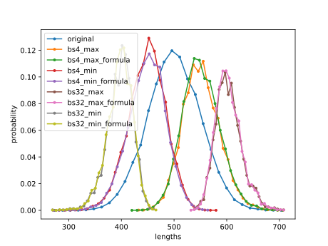
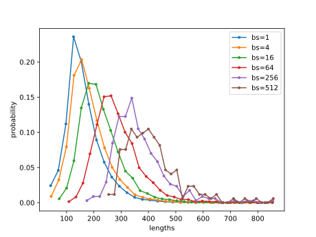
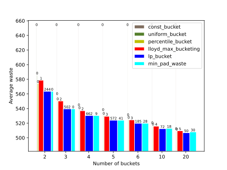
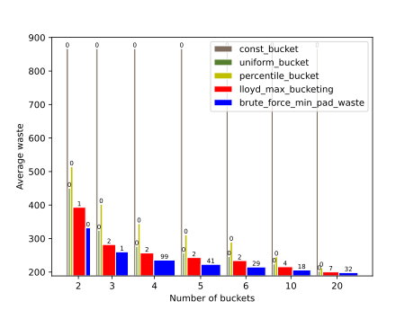
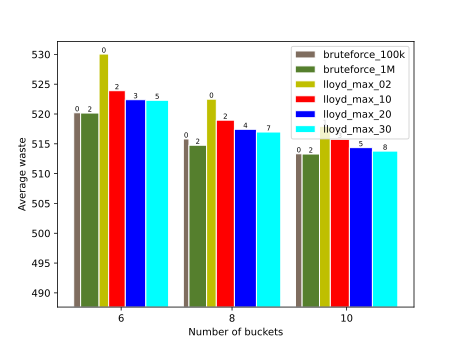

# Bucketing Algorithm Selection

## Introduction
Dynamic shapes in the input are often mitigated by bucketing. Please see here for [examples](https://docs.habana.ai/en/latest/PyTorch/Model_Optimization_PyTorch/Dynamic_Shapes.html#mitigation-through-bucketing-and-padding). This document and the concomitant code explores some advanced aspects of bucketing.

In the [first section](#discussion-about-shape-distribution-under-aggregating-functions), the probability distribution function (PDF) of input shapes after batching is discussed, to show that it is important to use this modified batched probability for bucketing, rather than the initial probability distribution of the dataset itself.

In the [second section](#determining-a-good-bucketing-algorithm) some tools are presented to evaluate different bucketing algorithms based on different metrics such as time-to-run and padding wastage, so that users can pick a method based on their needs.

## Shape Distribution Under Aggregating Functions

### Motivation
Consider the case where a dataset has one dimension that varies. For a concrete example consider a text dataset with varying sentence lengths.

Often training or inference is run in batches. Consider a batchsize of `b`. If sentences are batched, usually they are padded up to the largest sentence. Alternatively, they might be cut short to the shortest sentence. The upshot is that different aggregating functions like `min` or `max` can be applied on the original PDF after batching, which changes the original PDF substantially.

### Mathematical Background
Let the discrete random variable `X` denote the sentence length. Let the probability distribution function (PDF) of the sentence lengths be given by `f(X)` and the cumulative distribution fucntion by `F(X)`.

Probability distribution of order statictics given the original PDF can be found in many references, such as [this one](https://www2.stat.duke.edu/courses/Spring12/sta104.1/Lectures/Lec15.pdf). The table below shows how to calculate them under certain scenarios.

| Aggregator      | Distribution | Mean of aggregate wrt original | Variance of aggregate wrt original |
| ----------- | ----------- | ----------- | ----------- |
| Max      | $f_n(x) = nf(x)F(x)^{n-1}$      | increase | decrease |
| Min   | $f_n(x) = nf(x)(1-F(x))^{n-1}$        |  decrease | decrease |

Using the formulae above, one can get the PDF of the batch length, given the PDF of the original sentences. An example is shown [here](#example-with-gaussian-distribution).

The batched dataloader can be used directly to generate samples for the bucketing algorithm in the following cases:
1. The aggregator might be too complex to have a closed form analysis (like shown in the examples above)
2. It might be just easier to sample from the dataloader
The only issue of sampling from the dataloader is that one has to iterate through the dataset, which might take some time. One might rerun the bucketing for a different batchsize, which will require us to rerun the dataloader, which might be time consuming.


### Example with Gaussian Distribution

In this example, a pseudo dataset is simulated, whose shapes vary according to a Gaussian distribution.  The original distribution is plotted, and then the batched distributions for batch=4 and batch=32. For both batches min and max aggregators are used, which create different PDFs. Finally the plot also shows the aggregated PDFs from sampling and from mathematically deriving it using the formulae in the previous [section](#mathematical-background). The sampled and the calculated PDFs coincide well for both min and max and for both batchsizes.


```
MPLBACKEND=TKAgg python run_demo_gaussian.py
```




### Example with SQUAD Dataset
```
MPLBACKEND=TKAgg python run_demo_squad.py
```

The sentence length distribution of SQUAD dataset is plotted, with collate function padding up the batch to maximum length in the batch. One can observe the expected trend of increasing mean and decreasing variance of the batched PDFs in the following plot. Thus, with this and the [previous](#example-with-gaussian-distribution) example one can see how drastically batching affects the PDF. Hence, it is important to bucket the batched dataset rather than the original one.




## Determining a Good Bucketing Algorithm


Please refer to [this](https://docs.habana.ai/en/latest/PyTorch/Model_Optimization_PyTorch/Dynamic_Shapes.html#mitigation-through-bucketing-and-padding) section for a brief discussion on the different types of bucketing algorithms. Broadly, there are 2 categories: 1) fast, simple but suboptimal and 2) optimization based methods.

In this section, different algorithms are compared based on metrics such as:
1) Time to complete: How long did the bucketing algorithm take to run (smaller is better).
2) Padding wastage: Amount of padding needed for the dataset given the bucket boundaries generated by the bucketing algorithm (smaller is better).

A new bucketing algorithm based on [Lloyd-Max quantizer](https://web.stanford.edu/class/ee398a/handouts/lectures/05-Quantization.pdf) is also introduced. The following table shows the algorithms that are analyzed.

| Name      | Type | Description | Comments |
| ----------- | ----------- | ----------- | ----------- |
| Constant | Fast, simple, sub-optimal | Pad to max of dataset | Expected to have worst padding wastage, but only 1 compilation |
| Uniform interval | Fast, simple, sub-optimal | Divide the lengths into uniform intervals | - |
| Percentile | Fast, simple, sub-optimal | Divide into percentiles of equal sizes | The best of the simple algorithms |
| Lloyd-Max | Optimization based | Lloyd-Max quantizer inspired iterative method | - |
| Brute force min pad waste | Optimization based | Use brute force and some tricks to find bucket boundaries| - |
| Linear Programming (LP) | Optimization based | Use linear programming to minimize padding waste | May not find a feasible solution in all cases |


### Example with Numbers
All these algorithms take a list of input shapes, number of buckets, and output bucket boundaries. For example given an input sequence of `[3,3,4,5,5,5,6,7,8,8]`, and number of buckets = 3, the algorithm might output `[5, 7]`. Note that only `n-1` numbers are needed when number of buckets is `n`, because the last bucket is always maximum length in the dataset. This means sentences of lengths in the interval `[3,5]` get padded to 5, lengths in interval `[6,8]` get padded to 8 and anything above gets padded to the max size 8. The sample dataset above will be padded to `[5,5,5,5,5,5,7,7,8,8]`. To evaluate its padding wastage metric, one finds the amount of padding for eact sentence, which is `[2,2,1,0,0,1,0,0,0]`, and then add it up to get `6`. To compare with padded everything up to the maximum length of 8, the wastage would have been `[5,5,4,3,3,3,2,1,0,0]` or a total of `26`.

### Example with Random Gaussian
```
MPLBACKEND=TKAgg python run_demo_bucketing_gaussian.py
```

In this section 1000 samples from a Gaussian distribution is bucketed. The chart below shows the padding wastage wrt number of buckets. A total of `6` algorithms are run for each bucket size. The width of the bar is logarithmically scaled to the time taken for that algorithm. The number on the top of each bar is the time taken for the algorithm to run.



The following trends are observed:
1. With increasing buckets, padding wastage goes down
2. The heuristic, non-optimization based methods are extremely fast, however they perform poorly compared to the optimization based methods.
3. Amongst the fast methods, percentile bucketing is the best
4. The best performing algorithms are LP bucketing and brute force min pad waste. However LP bucketing is slow.
5. Lloyd-Max offers a good tradeoff between speed and padding wastage

### Example with SQUAD
To run this example with SQUAD dataset, execute:
```
MPLBACKEND=TKAgg python run_demo_bucketing_squad.py
```

Similar trends as the Gaussian case in the last section are seen. The optimization based algorithms take longer but perform better than the simple heuristics based algorithms.


### Controlling Time Duration of Optimization based Algorithms
Some of the optimization based algorithms might expose a parameter to trade off between the time to run vs padding wastage.
| Algo      | Parameter | Effect of increasing |
| ----------- | ----------- | ----------- |
| lloyd_max_bucketing | max_steps | Increases compute time, might decrease pad waste |
| brute_force_min_pad_waste | max_elems | Increases compute time (up to a limit), might decrease pad waste |

```
MPLBACKEND=TKAgg python run_demo_controlling_num_steps.py
```


The graph shows the effect of increasing the parameters for the 2 algorithms mentioned above. Generally it is observed that increasing the parameters decrease padding waste at the expense of increased compute time.

### Tips on Interpreting the Results

1. One can use `bucket_analysis` tool's results (as shown in [gaussian](#example-with-random-gaussian) and [SQUAD](#example-with-squad) section) to decide when increasing number of buckets gives diminishing returns. For example in the Gaussian case it is observed that increasing buckets from 10 to 20 does not gain much.
2. In some cases, once one has optimized the model with some smaller number of buckets, one might still want more performance. So one can use the graphs shown above to decide if one will be able to save padding wastage if a larger number of buckets is used.
3. Bucketing is a one time thing, so does one care if it takes a long time to run? In some cases yes. For example Roboflow has 100 datasets, so running bucketing 100 times with a fast bucketing algorithm might save significant amount of time. Sometimes the dataset might be changing during the course of training, so it may make sense to run the bucketing algorithm from time to time.
