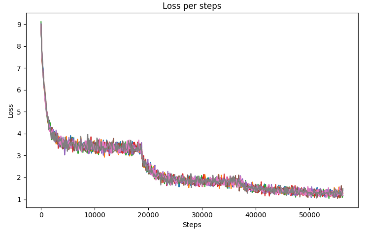
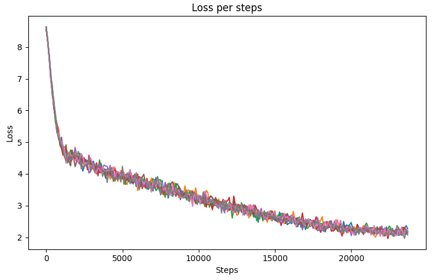
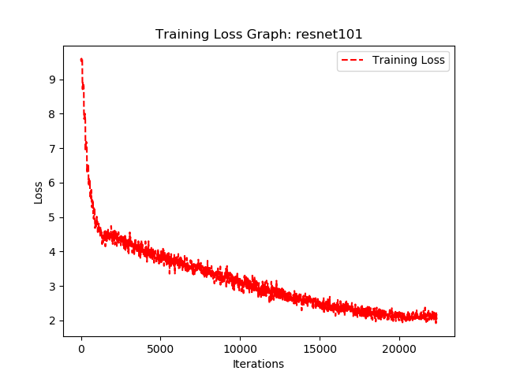
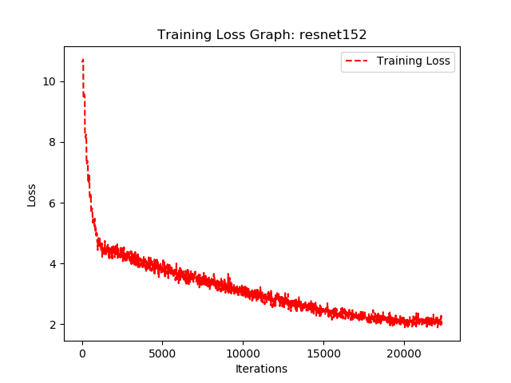

# ResNet For TensorFlow

This repository provides a script and recipe to train the ResNet v1.5 models to achieve state-of-the-art accuracy, and is tested and maintained by Habana.

## Table Of Contents
* [Model overview](#model-overview)
* [Model Setup](#model-setup)
* [Training the Model](#training-the-model)
* [Training Results](#Training-Results)
* [Preview Python Script](#Preview-Python-Script)
* [Known Issues](#known-issues)


## Model Overview
Both ResNet v1.5 and ResNeXt model is a modified version of the original ResNet v1 model. It supports layers 50, 101, and 152.

Changes specific to Gaudi that were made comparing to original script are noted in [separate document](./changes.md).

### Hyperparameters
**ResNet SGD:**

* Momentum (0.9),
* Learning rate (LR) = 0.128 (single node) or 0.1 (multinode) for 256 batch size. For other batch sizes we linearly scale the learning rate.
* Piecewise learning rate schedule.
* Linear warmup of the learning rate during the first 3 epochs.
* Weight decay: 0.0001.
* Label Smoothing: 0.1.

**ResNet LARS:**

* Momentum (0.9),
* Learning rate (LR) = 2.5 (single node) or 9.5 (1 HLS, i.e. 8 gaudis, global batch 2048 (8*256)) (1).
* Polynomial learning rate schedule.
* Linear warmup of the learning rate during the first 3 epochs (1).
* Weight decay: 0.0001.
* Label Smoothing: 0.1.

(1) These numbers apply for batch size lower than 8192. There are other configurations for higher global batch sizes. Note, however, that they haven't been tested yet:

* (8192 < batch size < 16384): LR = 10, warmup epochs = 5,
* (16384 < batch size < 32768): LR = 25, warmup epochs = 5,
* (bachsize > 32768): LR = 32, warmup epochs = 14.

**ResNeXt:**

* Momentum (0.875).
* Learning rate (LR) = 0.256 for 256 batch size, for other batch sizes we linearly scale the learning rate.
* Cosine learning rate schedule.
* Linear warmup of the learning rate during the first 8 epochs.
* Weight decay: 6.103515625e-05
* Label Smoothing: 0.1.

We do not apply Weight decay on batch norm trainable parameters (gamma/bias).
We train for:
  * 90 Epochs -> 90 epochs is a standard for ResNet family networks.
  * 250 Epochs -> best possible accuracy.
For 250 epoch training we also use [MixUp regularization](https://arxiv.org/pdf/1710.09412.pdf).

### Data Augmentation
This model uses the following data augmentation:

* For training:
    * Normalization.
    * Random resized crop to 224x224.
        * Scale from 8% to 100%.
        * Aspect ratio from 3/4 to 4/3.
    * Random horizontal flip.
* For inference:
    * Normalization.
    * Scale to 256x256.
    * Center crop to 224x224.

## Setup

### Install Drivers
Follow steps in the [Installation Guide](https://docs.habana.ai/projects/SynapeAI-Gaudi/en/latest/Installation_Guide/GAUDI_Installation_Guide.html) to install the driver.

### Training Data

The ResNet50 v1.5 script operates on ImageNet 1k, a widely popular image
classification dataset from the ILSVRC challenge.

1. Sign up with http://image-net.org/download-images and acquire the rights to download original images
2. Follow the link to the 2012 ILSVRC
 and download `ILSVRC2012_img_val.tar` and `ILSVRC2012_img_train.tar` to this directory.
3. Ensure Python3 and the following Python packages are installed: TensorFlow 2.2 and `absl-py`.

```
mkdir /path/to/imagenet_data
export IMAGENET_HOME=/path/to/imagenet_data
mkdir -p $IMAGENET_HOME/img_val
mkdir -p $IMAGENET_HOME/img_train
tar xf ILSVRC2012_img_val.tar -C $IMAGENET_HOME/img_val
tar xf ILSVRC2012_img_train.tar -C $IMAGENET_HOME/img_train
cd $IMAGENET_HOME/img_train
for f in *.tar; do
  d=`basename $f .tar`
  mkdir $d
  tar xf $f -C $d
done
cd $IMAGENET_HOME
rm $IMAGENET_HOME/img_train/*.tar # optional
wget -O synset_labels.txt https://raw.githubusercontent.com/tensorflow/models/master/research/slim/datasets/imagenet_2012_validation_synset_labels.txt
cd Model-References/TensorFlow/computer_vision/Resnets
python3 preprocess_imagenet.py \
  --raw_data_dir=$IMAGENET_HOME \
  --local_scratch_dir=$IMAGENET_HOME/tf_records \
  --nogcs_upload
```

The above commands will create `tf_record` files in `/path/to/imagenet_data/tf_records`

### Training the Model

1. Download docker
```
docker pull vault.habana.ai/gaudi-docker/0.13.0/ubuntu18.04/habanalabs/tensorflow-installer:0.13.0-380
```

2. Run docker

**NOTE:** This assumes the Imagenet dataset is under /opt/datasets/imagenet on the host. Modify accordingly.

```
docker run -it -v /dev:/dev --device=/dev:/dev -e OMPI_MCA_btl_vader_single_copy_mechanism=none --cap-add=sys_nice  -v /sys/kernel/debug:/sys/kernel/debug -v /opt/datasets/imagenet:/root/tensorflow_datasets/imagenet --net=host vault.habana.ai/gaudi-docker/0.13.0/ubuntu18.04/habanalabs/tensorflow-installer:0.13.0-380
```

OPTIONAL with mounted shared folder to transfer files out of docker:

```
docker run -it -v /dev:/dev --device=/dev:/dev -e OMPI_MCA_btl_vader_single_copy_mechanism=none --cap-add=sys_nice  -v /sys/kernel/debug:/sys/kernel/debug -v ~/shared:/root/shared -v /opt/datasets/imagenet:/root/tensorflow_datasets/imagenet --net=host vault.habana.ai/gaudi-docker/0.13.0/ubuntu18.04/habanalabs/tensorflow-installer:0.13.0-380
```

3. Clone the repository and go to resnet directory:

```
git clone https://github.com/HabanaAI/Model-References.git
cd Model-References/TensorFlow/computer_vision/Resnets
```

Note: If the repository is not in the PYTHONPATH, make sure you update it.
```
export PYTHONPATH=/path/to/Model-References:$PYTHONPATH
```

### Single-Card Training
#### The demo_resnet script

The script for training and evaluating the ResNet model has a variety of paramaters.
```
usage: ./demo_resnet [arguments]

mandatory arguments:
  -d <data_type>,    --dtype <data_type>             Data type, possible values: fp32, bf16

optional arguments:
  -rs <resnet_size>, --resnet-size <resnet_size>     ResNet size, default 50 (or 101, when --resnext flag is given),
                                                     possible values: 50, 101, 152
  -b <batch_size>,   --batch-size <batch_size>       Batch size, default 128 for fp32, 256 for bf16
  -e <epochs>,       --epochs <epochs>               Number of epochs, default to 1
  -a <data_dir>,     --data-dir <data_dir>           Data dir, defaults to /software/data/tf/data/imagenet/tf_records/
  -m <model_dir>,    --model-dir <model_dir>         Model dir, defaults to /home/user1/tmp/resnet50/
  -o,                --use-horovod                   Use horovod for training
  -s <steps>,        --steps <steps>                 Max train steps
  -l <steps>,        --eval-steps <steps>            Max evaluation steps
  -n,                --no-eval                       Don't do evaluation
  -v <steps>,        --display-steps <steps>         How often display step status
  -c <steps>,        --checkpoint-steps <steps>      How often save checkpoint
  -r                 --recover                       If crashed restart training from last checkpoint. Requires -s to be set
  -k                 --no-experimental-preloading    Disables support for 'data.experimental.prefetch_to_device' TensorFlow operator. If not set:
                                                     - loads extension dynpatch_prf_remote_call.so (via LD_PRELOAD)
                                                     - sets environment variable HBN_TF_REGISTER_DATASETOPS to 1
                                                     - this feature is experimental and works only with single node
                     --use-train-and-evaluate        If set, uses tf.estimator.train_and_evaluate for the training and evaluation
                     --epochs-between-evals <epochs> Number of training epochs between evaluations, default 1
                     --enable-lars-optimizer         If set uses LARSOptimizer instead of default one
                     --stop_threshold <accuracy>     Threshold accuracy which should trigger the end of training.
                     --resnext                       Run resnext
```

These are example run commands:
```
examples:
  ./demo_resnet -d bf16
  ./demo_resnet -d fp32
  ./demo_resnet -d fp32 -rs 101
  ./demo_resnet -d bf16 -s 1000
  ./demo_resnet -d bf16 -s 1000 -l 50
  ./demo_resnet -d bf16 -e 9
  ./demo_resnet -d fp32 -e 9 -b 128 -a /root/tensorflow_datasets/imagenet/tf_records/ -m /root/tensorflow-training/demo/ck_81_080_450_bs128
```

#### The demo_keras_resnet script
This script uses Keras, a high-level neural networks library running on top of Tensorflow for training and evaluating the ResNet model:
```
usage: ./demo_keras_resnet [arguments]
mandatory arguments:
  -d <data_type>,    --dtype <data_type>          Data type, possible values: fp32, bf16
optional arguments:
  -b <batch_size>,   --batch-size <batch_size>    Batch size, default 128 for fp32, 256 for bf16"
  -e <epochs>,       --epochs <epochs>            Number of epochs, default to 1"
  -a <data_dir>,     --data-dir <data_dir>        Data dir, defaults to /software/data/tf/data/imagenet/tf_records/
  -m <model_dir>,    --model-dir <model_dir>      Model dir, defaults to $HOME/tmp/resnet/
  -o,                --use-horovod                Use horovod for training
  -s <steps>,        --steps <steps>              Max train steps
  -n,                --no-eval                    Don't do evaluation
  -v <steps>,        --display-steps <steps>      How often display step status
  -l <steps>,        --steps-per-loop             Number of steps per training loop. Will be capped at steps per epoch.
  -c,                --enable-checkpoint          Whether to enable a checkpoint callback and export the savedmodel.
  -r                 --recover                    If crashed restart training from last checkpoint. Requires -s to be set
  -k                 --no-experimental-preloading Disables support for 'data.experimental.prefetch_to_device' TensorFlow operator. If not set:
                                                  - loads extension dynpatch_prf_remote_call.so (via LD_PRELOAD)
                                                  - sets environment variable HBN_TF_REGISTER_DATASETOPS to 1
                                                  - this feature is experimental and works only with single node
example:
  ./demo_keras_resnet -d bf16
  ./demo_keras_resnet -d fp32
  ./demo_keras_resnet -d fp -rs 101
  ./demo_keras_resnet -d bf16 -s 1000
  ./demo_keras_resnet -d bf16 -s 1000 -l 50
  ./demo_keras_resnet -d bf16 -e 9"
  ./demo_keras_resnet -d fp32 -e 9 -b 128 -a home/user1/tensorflow_datasets/imagenet/tf_records/ -m /home/user1/tensorflow-training/demo/ck_81_080_450_bs128

```

### Multi-Card Training

#### The demo_resnet_hvd.sh script

The script requires additional parameters.

```
export IMAGENET_DIR=/path/to/tensorflow_datasets/imagenet/
export RESNET_SIZE=<resnet-size>
./demo_resnet_hvd.sh
```

### Example Commands
To benchmark the training performance on a specific batch size, run:

**For single Gaudi**

ResNet 50 (FP32)

```
./demo_resnet -rs 50 -d fp32 -b 128 -a /path/to/tensorflow_datasets/imagenet/tf_records/ -m /root/tensorflow-training/demo/ck_81_080_450_bs128
```

ResNet 50 (BF16)

```
./demo_resnet -rs 50 -d bf16 -b 256 -a /path/to/tensorflow_datasets/imagenet/tf_records/ -m /root/tensorflow-training/demo/resnet50
```

ResNet 101 (BF16)

```
./demo_resnet -rs 101 -d bf16 -b 256 -a /path/to/tensorflow_datasets/imagenet/tf_records/ -m /root/tensorflow-training/demo/resnet101
```

ResNeXt 101 (BF16)

```
./demo_resnet -rs 101 --resnext -d bf16 -b 256 -a /path/to/tensorflow_datasets/imagenet/tf_records/ -m /root/tensorflow-training/demo/resnext101
```

**For multiple Gaudi cards**

ResNet 50 (BF16)
```
export IMAGENET_DIR=/path/to/tensorflow_datasets/imagenet/
export RESNET_SIZE=50
./demo_resnet_hvd.sh
```
ResNet 101 (BF16)
```
export IMAGENET_DIR=/path/to/tensorflow_datasets/imagenet/
export RESNET_SIZE=101
./demo_resnet_hvd.sh
```
ResNeXt 101 (BF16)
```
export IMAGENET_DIR=/path/to/tensorflow_datasets/imagenet/
export RESNET_SIZE=101
./demo_resnet_hvd.sh --resnext
```

## Training Results

The following sections provide details on how we achieved our training performance and accuracy.

### Single card validation accuracy and performance results:

For Resnet50 Keras API, SGD, LARS model:

The following results were obtained by running these training scripts:

ResNet50 Keras:

```
./demo_keras_resnet -d bf16 -e 90
```

ResNet50 SGD:

```
./demo_resnet -rs 50 -d bf16 -b 256 -e 90
```

ResNet50 LARS:

```
./demo_resnet --enable-lars-optimizer -rs 50 -d bf16 -b 256 -e 38
```


|   Model   | Epochs | Batch Size / Card | Accuracy BF16 - (top1) | Throughput (ave) - BF16 |
|-----------|--------|-------------------|------------------------|-------------------------|
| ResNet50  (Keras)  | 90    | 256      | 0.7615    | 1670 img/s     |
| ResNet50  SGD      | 90    | 256      | 0.764     |  1554 img/s    |
| ResNet50  LARS     | 38    | 256      | N/A       |  1519 img/s     |


### Multiple cards validation accuracy and performance results in Habana HLS-1 Multiple Cards (8x Habana HL-205)

The results were obtained by running the `demo_resnet_hvd.sh` training script in the 0.13.0-380 container with Evaluation is performed every 5000 iterations and checkpoint is saved every 5005 iterations. The performance numbers (in images per second) were averaged over the whole iterations, excluding the first one.

For ResNet50/101/152 SGD:
```
export IMAGENET_DIR=/path/to/tensorflow_datasets/imagenet/
export USE_LARS_OPTIMIZER=0
RESNET_SIZE=50   ./demo_resnet_hvd.sh
RESNET_SIZE=101  ./demo_resnet_hvd.sh
RESNET_SIZE=152  ./demo_resnet_hvd.sh
```

For ResNet50/101/152 LARS:

```
export IMAGENET_DIR=/path/to/tensorflow_datasets/imagenet/
export USE_LARS_OPTIMIZER=1
RESNET_SIZE=50   ./demo_resnet_hvd.sh
RESNET_SIZE=101  ./demo_resnet_hvd.sh
RESNET_SIZE=152  ./demo_resnet_hvd.sh
```

&nbsp;


| Model | Epochs |Cards| Batch Size / Card | Accuracy BF16 - (top1) |Throughput (ave) -BF16 | Total time to train(minutes) |
|-----------|-----|------|------------------|----------------------|-------------|---------------------------|
| ResNet50 (SGD)  | 90   | 8  | 256         | 0.756 ~ 0.7615       |   11801.3 img/s    |     173                     |
| ResNet50 (LARS) | 38   | 8  | 256         | 0.755 ~ 0.759        |   11956 img/s      |     73                      |
| ResNet101 (SGD) | 90   | 8  | 256         |  N/A                 |   7399.5 img/s     |     N/A                     |
| ResNet101 (LARS)| 38   | 8  | 256         | 0.766                |   7312.2 img/s     |     127                     |
| ResNet152 (SGD) | 90   | 8  | 256         |  N/A                 |   5279.5 img/s     |      N/A                    |
| ResNet152 (LARS)| 38   | 8  | 256         | 0.773                |   4444.4 img/s     |     208                     |

&nbsp;

**Training Loss Curves:**

ResNet50 (SGD):



ResNet50 (LARS):



ResNet101 (LARS):



ResNet152 (LARS):




## Preview Python Script
This is the preview of TensorFlow ResNet Python scripts with yaml configuration of parameters
For single card (in the future multi-node workloads will be supported as well) you can use model runners that are written in Python as opposed to bash.

You can run the following script: **Model-References/TensorFlow/habana_model_runner.py** which accepts two arguments:
- --model *model_name*
- --hb_config *path_to_yaml_config_file*

Example of config files can be found in the **Model-References/TensorFlow/computer_vision/Resnets/resnet_estimator_default.yaml** (for resnet_estimator model) as well as **Model-References/TensorFlow/computer_vision/Resnets/resnet_keras/resnet_keras_default.yaml** (for resnet_keras model).

You can use these scripts as such:
> cd Model-References/TensorFlow/computer_vision/Resnets
  >
  > python3 ../../habana_model_runner.py --model resnet_estimator --hb_config *path_to_yaml_config_file*
  >
  > **Example:**
  >
  > python3 ../../habana_model_runner.py --model resnet_estimator --hb_config resnet_estimator_default.yaml

### Change Log

## Known Issues
1. RN50 with LARS optimizer reaches accuracy 75.5-76% after 38 epochs - adjusting it to always reach at least 75.9% accuracy (required by MLPerf) is planned for consequent releases.
2. RN50 with SGD optimizer reaches accuracy in range 75.5-76.1% after 90 epochs - adjusting it to always reach at least 76% accuracy is planned for consequent releases.
3. There is 3-4% single node performance degradation comparing to 0.12 release as a result of functional fix bringing back control edges that were incorrectly optimized out. Restoring previous performance is planned in consequent releases.


