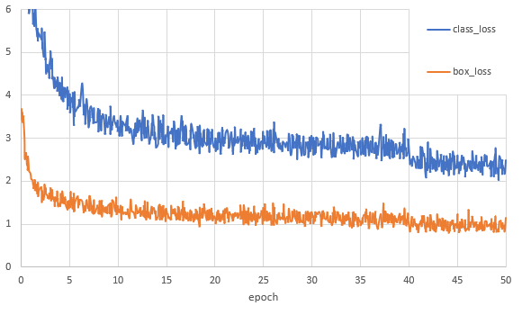
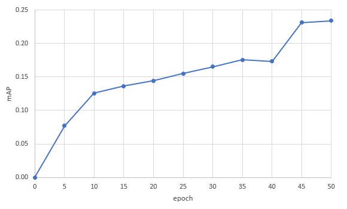

# SSD_ResNet34

* [Model overview](#model-overview)
  * [Default configuration](#default-configuration)
* [Setup](#setup)
  * [Requirements](#requirements)
  * [Download and preprocess COCO2017 dataset](#download-and-preprocess-coco2017-dataset)
  * [Download pretrained ResNet34 weights](#download-pretrained-resnet34-weights)
  * [Run training on single node](#run-training-on-single-node)
  * [Run training on multinode](#run-training-on-multinode)
  * [Training Examples](#training-examples)
  * [Run evaluation](#run-evaluation)
* [Advanced](#advanced)
  * [Scripts and sample code](#scripts-and-sample-code)
  * [Parameters](#parameters)
* [Results](#results)
  * [Training accuracy results](#training-accuracy-results)
  * [Training performance results](#training-performance-results)
  * [Loss Curves](#loss-curves)
  * [mAP values](#mAP-values)
* [Known issues](#known-issues)

## Model Overview

This repository provides a script to train the Single Shot Detection (SSD) (Liu et al., 2016) with backbone ResNet-34 trained with COCO2017 dataset on Habana Gaudi (HPU). It is based on the MLPerf training 0.6 implementation by Google. The model provides output as bounding boxes.
The details of all the changes made to the model can be found in `changes.md` file.

### Default configuration

- Learning rate base = 3e-3
- Weight decay = 5e-4
- Epochs for learning rate Warm-up  = 5
- Batch size = 128
- Epochs for training = 50
- Data type = bf16
- Loss calculation = False
- Mode = train
- Epochs at which learning rate decays = 0
- Number of samples for evaluation = 5000
- Number of example in one epoch = 117266
- Number of training steps = 0
- Frequency of printing loss = 1
- Frequency of saving checkpoints = 5
- Maximum number of checkpoints stored = 20

The TTT on default configuration for multinode (node=8) was 42 minutes.

## Setup

### Requirements

Habana drivers installed along with its dependencies which can be found [here](https://docs.habana.ai/projects/SynapeAI-Gaudi/en/latest/Installation_Guide/GAUDI_Installation_Guide.html).

#### Get the Habana Tensorflow docker image
```bash
docker pull vault.habana.ai/gaudi-docker/0.13.0/ubuntu18.04/habanalabs/tensorflow-installer:0.13.0-380
```

### Launch the Docker container
```bash
docker run -it -v /data:/data -v /tmp:/tmp --device=/dev:/dev -v /dev:/dev -e OMPI_MCA_btl_vader_single_copy_mechanism=none \
   --cap-add=sys_nice -e DISPLAY=$DISPLAY -e PYTHONPATH=/usr/lib/habanalabs/:/root:/root/model_garden \
   -v /sys/kernel/debug:/sys/kernel/debug --user=root --workdir=/root --net=host \
   vault.habana.ai/gaudi-docker/0.13.0/ubuntu18.04/habanalabs/tensorflow-installer:0.13.0-380
```

### Clone Habana Model Garden
```bash
git clone https://github.com/HabanaAI/Model-References /root/model_garden
cd /root/model_garden/TensorFlow/computer_vision/SSD_ResNet34
```
### Download and preprocess COCO2017 dataset

The topology script is already configured for COCO2017 (117266 training images, 5000 validation images).

Only images with any bounding box annotations are used for training.
The dataset directory should be mounted to `/data/coco2017/ssd_tf_records`.

The topology uses tf-records which can be prepared in the following way:
```bash
cd /root/model_garden/TensorFlow/computer_vision/SSD_ResNet34
export TMP_DIR=$(mktemp -d)
export SSD_PATH=$(pwd)
pushd $TMP_DIR
git clone https://github.com/tensorflow/tpu
cd tpu
git checkout 0ffe1274745806c411ed3dda7e84f692e00df8af
git apply ${SSD_PATH}/coco-tf-records.patch
cd tools/datasets
bash download_and_preprocess_coco.sh /data/coco2017/ssd_tf_records
popd
rm -rf $TMP_DIR
```
### Download pretrained ResNet34 weights

The topology uses pretrained ResNet34 weights.
They should be mounted to `/data/ssd_r34-mlperf/mlperf_artifact`.

Weights used in MLPerf benchmark can be downloaded from [here](https://console.cloud.google.com/storage/browser/mlperf_artifcats/v0.6_training).

Habana will be providing distinct pretrained ResNet34 weights soon.
```bash
$ md5sum /data/ssd_r34-mlperf/mlperf_artifact/*
7e9f4ba94c150b5c0c073cb738e7ad39  /data/ssd_r34-mlperf/mlperf_artifact/checkpoint
1b7fabd0872b765da2fc60af46fe6390  /data/ssd_r34-mlperf/mlperf_artifact/model.ckpt-28152.data-00000-of-00001
96080eb2d106f7bd4a682bde003b1436  /data/ssd_r34-mlperf/mlperf_artifact/model.ckpt-28152.index
6b31dd1a042cdbbb2fd7fcd6f2c5e843  /data/ssd_r34-mlperf/mlperf_artifact/model.ckpt-28152.meta
```

### Run training on single node

The following command will train the topology on single node, batch size 128, 50 epochs, default hyperparameters.

```bash
./demo_ssd -e 50 -b 128 --model_dir /tmp/ssd_single_node
```
Each epoch will take ceil(117266 / 128) = 917 steps so the whole training will take 917 * 50 = 45850 steps.
Checkpoints will be saved to `/tmp/ssd_single_node`.

### Run training on multinode (8 nodes)

In order to train the topology on multinode (8 nodes), batch size 128, 50 epochs, default hyperparameters.

```bash
./demo_ssd -e 50 -b 128 --model_dir /tmp/ssd_8_nodes --multinode 8
```
Each epoch will take ceil(117266 / (128 * 8)) = 115 steps so the whole training will take 115 * 50 = 5750 steps.
Checkpoints will be saved in `/tmp/ssd_8_nodes`.

### Training Examples

|  Gaudi nodes, Batch Size, epochs, Precision       |                              Command Line                                           |
| ------------------------------------------------- | ----------------------------------------------------------------------------------- |
| 1-node, BS=128, e=50, Precision= bf16             | `./demo_ssd -e 50 -b 128 -d bf16 --model_dir /tmp/ssd_single_node`                  |
| 1-node, BS=256, e=50, Precision= bf16             | `./demo_ssd -e 50 -b 256 -d bf16 --model_dir /tmp/ssd_single_node`                  |
| 1-node, BS=128, e=50, Precision= fp32             | `./demo_ssd -e 50 -b 128 -d fp32 --model_dir /tmp/ssd_single_node`                  |
| 8-nodes, BS=128, e=50, Precision= bf16            | `./demo_ssd -e 50 -b 128 -d bf16 --model_dir /tmp/ssd_8_nodes --multinode 8`        |
| 8-nodes, BS=256, e=50, Precision= bf16            | `./demo_ssd -e 50 -b 256 -d bf16 --model_dir /tmp/ssd_8_nodes --multinode 8`        |

### Run evaluation

In order to calculate mAP for the saved checkpoints in `/tmp/ssd_single_node`:
```bash
./demo_ssd --mode eval --model_dir /tmp/ssd_single_node
```

Sample output (after training: single node, batch size 128, 50 epochs, bfloat16):
```bash
Average Precision (AP) @[ IoU=0.50:0.95 | area= all | maxDets=100 ] = 0.231
Average Precision (AP) @[ IoU=0.50 | area= all | maxDets=100 ] = 0.398
Average Precision (AP) @[ IoU=0.75 | area= all | maxDets=100 ] = 0.238
Average Precision (AP) @[ IoU=0.50:0.95 | area= small | maxDets=100 ] = 0.060
Average Precision (AP) @[ IoU=0.50:0.95 | area=medium | maxDets=100 ] = 0.243
Average Precision (AP) @[ IoU=0.50:0.95 | area= large | maxDets=100 ] = 0.372
Average Recall (AR) @[ IoU=0.50:0.95 | area= all | maxDets= 1 ] = 0.222
Average Recall (AR) @[ IoU=0.50:0.95 | area= all | maxDets= 10 ] = 0.327
Average Recall (AR) @[ IoU=0.50:0.95 | area= all | maxDets=100 ] = 0.345
Average Recall (AR) @[ IoU=0.50:0.95 | area= small | maxDets=100 ] = 0.104
Average Recall (AR) @[ IoU=0.50:0.95 | area=medium | maxDets=100 ] = 0.376
Average Recall (AR) @[ IoU=0.50:0.95 | area= large | maxDets=100 ] = 0.528
Current AP: 0.23068
COCO/AP value for step 45850 = 0.23067697914844262
```

## Advanced

The following section provides details of running training.

### Scripts and sample code

In the `root/model_garden/TensorFlow/computer_vision/SSD-ResNet34` directory, the most important files are:

* `demo_ssd`: Serves as a wrapper script for the training file `ssd.py`. Also preloads libjemalloc and allows to run distributed training as it contains the --multinode argument.
* `ssd.py`: The training script of the SSD model. Contains all the other arguments.

#### Preview of TensorFlow Resnet Python scripts with yaml configuration of parameters

During single card (in the future multi-node workloads will be supported as well) training you can use model runners that are written in Python as opposed to bash.

You can run the following script: `/root/model_garden/TensorFlow/habana_model_runner.py` which accepts two arguments:
```
- --model *model_name*
- --hb_config *path_to_yaml_config_file*
```
Example of config files can be found in the `/root/model_garden/TensorFlow/computer_vision/SSD_ResNet34/ssd_resnet34_default.yaml`.

You can use these scripts as such:
```bash
cd model_garden/TensorFlow/computer_vision/SSD_ResNet34
python3 ../../habana_model_runner.py --model ssd_resnet34 --hb_config ssd_resnet34_default.yaml
```
### Parameters

Modify the training behavior through the various flags present in the `ssd.py` file. Some of the important parameters in the
`ssd.py` script are as follows:

-  `-d` or `--dtype`            : Data type, `fp32` or `bf16`
-  `-b` or `--batch_size`       : Batch size
-  `-e`, `--epochs`             : Epochs
-  `--mode`                     : Different types: train,eval
-  `--no_hpu`                   : Do not load habana module. Hence train of CPU/GPU
-  `--use_horovod`              : Use Horovod for distributed training
-  `--inference`                : Path to image for inference (if set then mode is ignored)
-  `-f`, `--use_fake_data`      : Use fake data to reduce the input preprocessing overhead
-  `--calculate_loss`           : By default loss is not calculated in order to improve performance (loss=99999.9)
-  `--val_json_file`            : COCO validation JSON containing golden bounding boxes (default: `DEFAULT_VAL_JSON_PATH`)
-  `--resnet_checkpoint`        : Location of the ResNet ckpt to use for model (default: `DEFAULT_RN34_CKPT_PATH`)
-  `--training_file_pattern`    : Prefix for training data files  (default: `DEFAULT_TRAINING_FILE_PATTERN`)
-  `--val_file_pattern`         : Prefix for evaluation tfrecords (default: `DEFAULT_VAL_FILE_PATTERN`)
-  `-v`                         : How often print `global_step/sec` and loss
-  `-c`                         : How often save checkpoints
-  `-p`                         : Run TF ProfilerHook

Note: Please find the exhaustive list of all modifiable parameters in `ssd.py` file or use `./demo_ssd -h`

## Results

The following sections provide details on performance and accuracy in training.
The results were obtained by running on GAUDI.

### Training accuracy results

|   Number of GAUDIs   |   Batch size  |     Precision     |       mAP      |
| -------------------- | ------------- | ----------------- | -------------- |
|            1         |     128       |        bf16       |      0.23      |
|            8         |     128       |        bf16       |      0.229     |

### Training performance results

|   Number of GAUDIs   |   Batch size   |   bf16 img/s   |   fp32 img/s   |
| -------------------- | -------------- | -------------- | -------------- |
|            1         |    64          |       442      |        141     |
|            1         |    128         |       458      |        142     |
|            8         |    128         |      3280      |                |


### Loss Curves


The loss curves were obtained for SSD training on 8 Gaudi cards with data collected using parameter values mentioned in the following command:
```bash
./demo_ssd -d fp32 -b 64 --multinode 8  --lr_warmup_epoch 5 --base_lr 5.84e-3 --weight_decay 1.6e-4
```

### mAP values


mAP values were calculated for checkpoints from the sample training described above.

mAP after 50th epoch was 0.2337.

## Known issues
* dataloader does not use [`tf.data.Dataset.cache()`]("https://www.tensorflow.org/versions/r2.2/api_docs/python/tf/data/Dataset#cache") during single node training
* sporadic NaNs and low accuracy in multinode trainings
