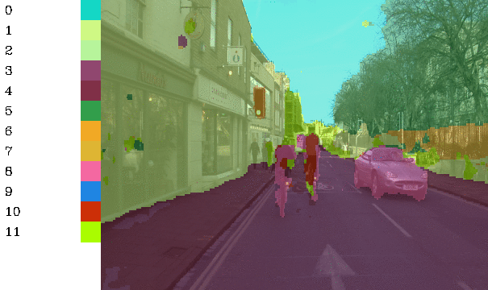

# Implementation of VGG-Segnet for Semantic Segmentation in Keras.


## Table of Contents
For more information about training deep learning models on Gaudi, visit developer.habana.ai.
* [Model-References](../../../README.md)
* [Model overview](#model-overview)
* [Setup](#setup)
* [Training](#training-the-model)
* [Known Issues](#known-issues)


## Model Overview
This repo implements semantic segmentation in Keras using VGG-Segnet. It is adapted from [here](https://github.com/divamgupta/image-segmentation-keras). The paper this repo follows is [here](https://arxiv.org/pdf/1511.00561.pdf)

VGG-Segnet consists of a VGG backbone, followed by furthur layers of convolution and upsampling. The final layer is of the same size as the input with same number of channels as number of classes. Thus the network predicts a class for each pixel in the input image.

<p align="center">
  
</p>


Changes made to the reference [github](https://github.com/divamgupta/image-segmentation-keras) are:
* This repo focusses on VGG backbone, while the original one has other backbone options
* Experiments were done in both bf16 and float32 mode instead of float32 only in the original repo


## Setup
Please follow the instructions given in the following link for setting up the
environment including the `$PYTHON` environment variable: [Gaudi Setup and
Installation Guide](https://github.com/HabanaAI/Setup_and_Install). Please
answer the questions in the guide according to your preferences. This guide will
walk you through the process of setting up your system to run the model on
Gaudi.


Download VGG weights:
```shell
wget https://github.com/fchollet/deep-learning-models/releases/download/v0.1/vgg16_weights_tf_dim_ordering_tf_kernels_notop.h5
```

### Installing

Install the module

```shell
git clone https://github.com/HabanaAI/Model-References /root/Model-References
cd /root/Model-References
export PYTHONPATH=/root/Model-References:$PYTHONPATH
cd /root/Model-References/TensorFlow/computer_vision/Segnet
python3 setup.py install
```

### Preparing the data for training

You need to make two folders

* Images Folder - For all the training images
* Annotations Folder - For the corresponding ground truth segmentation images

The filenames of the annotation images should be same as the filenames of the RGB images.

The size of the annotation image for the corresponding RGB image should be same.

For each pixel in the RGB image, the class label of that pixel in the annotation image would be the value of the blue pixel.

Example code to generate annotation images :

```python
import cv2
import numpy as np

ann_img = np.zeros((30,30,3)).astype('uint8')
ann_img[ 3 , 4 ] = 1 # this would set the label of pixel 3,4 as 1

cv2.imwrite( "ann_1.png" ,ann_img )
```

Only use bmp or png format for the annotation images.

#### Download the sample prepared dataset

To start off, download and extract the following dataset:

https://drive.google.com/file/d/0B0d9ZiqAgFkiOHR1NTJhWVJMNEU/view?usp=sharing

You will get a folder named `dataset1/`. You can use `./data_prepare.sh` to download the data


## Training the Model

`demo_segnet.py` is the starting point of running. It can run distributed or single runs. Internally it calls `python3 -m keras_segmentation train`. It is assumed steps described in data preparation are done (or `./data_prepare.sh` has been run)

Some sample command lines are present here:

| Run type      | Script |
| ----------- | ----------- |
| HPU, BF16   | `./RUNME_HPU_BF16.sh`        |
| HPU, FP32   | `./RUNME_HPU_FP32.sh`        |
| HPU, BF16, distributed   | `./RUNME_HPU_BF16_DIST.sh`        |
| HPU, FP32, distributed   | `./RUNME_HPU_FP32_DIST.sh`        |
| CPU      | `./RUNME_CPU.sh`       |


## Results

Example results:



# Known Issues

In this repo, we use cross entropy as the loss. That only works if the relative distribution of the classes are uniform. In case the dataset has a skewed distribution of classes, then a different loss function should be used, such as dice.