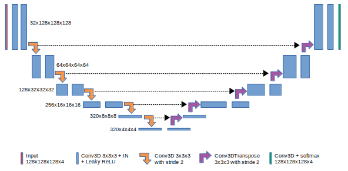

# UNet3D for TensorFlow 2

This directory provides a script and recipe to train a 3D-UNet medical image segmentation model for TensorFlow 2.x to achieve state of the art accuracy, and is tested and maintained by Habana. For further information on performance, refer to [Habana Model Performance Data page](https://developer.habana.ai/resources/habana-training-models/#performance).

For further information on training deep learning models using Gaudi, refer to [developer.habana.ai](https://developer.habana.ai/resources/).

## Table of Contents

* [Model-References](../../../README.md)
* [Model overview](#model-overview)
* [Setup](#setup)
* [Training and Examples](#training-and-examples)
* [Advanced](#advanced)
* [Supported Configuration](#supported-configuration)
* [Changelog](#changelog)

## Model Overview

The U-Net model is a convolutional neural network for 3D image segmentation. This repository contains a UNet3D implementation introduced in [3D U-Net: Learning Dense Volumetric Segmentation from Sparse Annotation](https://arxiv.org/pdf/1606.06650), with modifications described in [No New-Net](https://arxiv.org/pdf/1809.10483). It is based on [UNet3D Medical Image Segmentation for TensorFlow 1.x](https://github.com/NVIDIA/DeepLearningExamples/tree/master/TensorFlow/Segmentation/UNet_3D_Medical) repository.

### Model Architecture

UNet3D was first introduced by Olaf Ronneberger, Philip Fischer and Thomas Brox in [UNet3D Learning Dense Volumetric Segmentation from Sparse Annotation](https://arxiv.org/pdf/1606.06650). In this repository we host a UNet3D version adapted by Fabian Isensee et al. to brain tumor segmentation. UNet3D allows for seamless segmentation of 3D volumes, with high accuracy and performance, and can be adapted to solve many different segmentation problems.

The following figure shows the construction of the UNet3D model and its different components. UNet3D is composed of a contractive and an expanding path, that aims at building a bottleneck in its centermost part through a combination of convolution and pooling operations. After this bottleneck, the image is reconstructed through a combination of convolutions and upsampling. Skip connections are added with the goal of helping the backward flow of gradients in order to improve the training.



UNet3D consists of a contractive (left-side) and expanding (right-side) path. It repeatedly applies un-padded convolutions followed by max pooling for downsampling. Every step in the expanding path consists of an upsampling of the feature maps and a concatenation with the correspondingly cropped feature map from the contractive path.

### Model Changes

The following are the major changes that were implemented to the original model from [UNet3D Medical Image Segmentation for TensorFlow 1.x](https://github.com/NVIDIA/DeepLearningExamples/tree/master/TensorFlow/Segmentation/UNet_3D_Medical):

* Changed some scripts to run the model on Gaudi. This includes loading habana tensorflow modules.
* Converted all the scripts to Tensorflow 2.x version.
* Added support for using bfloat16 precision instead of float16.
* Added further TensorBoard and performance logging options.
* Removed GPU specific files (examples/*, Dockerfile etc.) and some unused codes.
* Added further synthetic data and tensor dumping options.
* Enabled the tf.data.experimental.prefetch_to_device for HPU device to improve performance.

### Default Configuration

- Execution mode: train and evaluate
- Batch size: 2
- Data type: bfloat16
- Maximum number of steps: 16000
- Learning rate: 0.0002
- Loss: dice+ce
- Normalization block: instancenorm
- Include background in predictions and labels: False
- Number of Horovod workers (HPUs): 1
- Data augmentation: True
- Using XLA: True
- Resume training from checkpoint: False
- Logging losses and performance every N steps: 100
- Tensorboard logging: False
- Logging data from every worker: False

## Setup

Please follow the instructions provided in the [Gaudi Installation Guide](https://docs.habana.ai/en/latest/Installation_Guide/GAUDI_Installation_Guide.html) to set up the environment including the `$PYTHON` environment variable.  To achieve the best performance, please follow the methods outlined in the [Optimizing Training Platform guide](https://docs.habana.ai/en/latest/TensorFlow/Model_Optimization_TensorFlow/Optimization_Training_Platform.html).  
The guides will walk you through the process of setting up your system to run the model on Gaudi.  

### Clone Habana Model-References

In the docker container, clone this repository and switch to the branch that matches your SynapseAI version. You can run the [`hl-smi`](https://docs.habana.ai/en/latest/Management_and_Monitoring/System_Management_Tools_Guide/System_Management_Tools.html#hl-smi-utility-options) utility to determine the SynapseAI version.

```bash
git clone https://github.com/HabanaAI/Model-References /root/Model-References
cd /root/Model-References/TensorFlow/computer_vision/UNet3D
```

**Note:** If Model-References repository path is not in the PYTHONPATH, make sure you update it:
```bash
export PYTHONPATH=$PYTHONPATH:/root/Model-References
```

### Download and Pre-process the Dataset

1. To obtain the dataset, register on [Brain Tumor Segmentation 2019 dataset](https://www.med.upenn.edu/cbica/brats-2019/) website. The data should be downloaded and placed where `/dataset` in the container is mounted. The `dataset/preprocess_data.py` script will convert the raw data into tfrecord format used for training and evaluation.

2. To launch the script, run:

```bash
$PYTHON dataset/preprocess_data.py -i /dataset -o /dataset_preprocessed -v
```

### Install Model Requirements

1. In the docker container, go to the UNet3D directory:

```bash
cd /root/Model-References/TensorFlow/computer_vision/UNet3D
```

2. Install the required packages using pip:

```bash
$PYTHON -m pip install -r requirements.txt
```

## Training and Examples

### Single Card and Multi-Card Training Examples

**Run training on 1 HPU:**

```bash
$PYTHON main.py --data_dir <path/to/dataset> --dtype <precision> --model_dir <path/to/model_dir> --log_dir <path/to/log_dir> --tensorboard_logging
```

Run training on 1 HPU with batch size 2, bfloat16 precision and fold 0:

```bash
$PYTHON main.py --data_dir /dataset_preprocessed --dtype bf16 --model_dir /tmp/unet3d_1_hpu --log_dir /tmp/unet3d_1_hpu --tensorboard_logging
```

**Run training on 8 HPUs:**

**NOTE:** mpirun map-by PE attribute value may vary on your setup. For the recommended calculation, refer to the instructions detailed in [mpirun Configuration](https://docs.habana.ai/en/latest/TensorFlow/Tensorflow_Scaling_Guide/Horovod_Scaling/index.html#mpirun-configuration).

Run training on 8 HPUs via mpirun with batch size 2, bfloat16 precision and fold 0:

```bash
mpirun --allow-run-as-root --bind-to core --map-by socket:PE=6 --np 8 \
$PYTHON main.py --use_horovod --data_dir /dataset_preprocessed --dtype bf16 --model_dir /tmp/unet3d_8_hpus --log_dir /tmp/unet3d_8_hpus --tensorboard_logging --log_all_workers
```
**Run 5-fold Cross-Validation and compute average dice score:**

All the commands described above will train and evaluate the model on the dataset with fold 0. To perform 5-fold-cross-validation on the dataset and compute average dice score across 5 folds, the user can execute training script 5 times and calculate the average dice score manually or run bash script `5-cross-validation.sh`:

```bash
bash 5-cross-validation.sh <path/to/dataset> <path/for/results> <batch_size> <precision>
```

Run training on 8 HPUs 5-fold-cross-validation with batch size 2 and bfloat16 precision:

```bash
bash 5-cross-validation.sh /dataset_preprocessed /tmp/unet3d_8_hpus 2 bf16
```
## Advanced

The following sections provide further details on the dataset, running training and inference, and the training results.

### Scripts and Sample Code

In the root directory, the most important files are:
* `main.py`: Serves as the entry point to the application. Encapsulates the training routine.
* `requirements.txt`: Set of extra requirements for running U-Net.

The `dataset/` folder contains the necessary tools to train and perform inference using U-Net. Its main components are:
* `data_loader.py`: Implements the data loading and augmentation.
* `transforms.py`: Implements the data augmentation functions.
* `preprocess_data.py`: Implements the data conversion and pre-processing functionality.

The `runtime/` folder contains scripts with training and inference logic. Its contents are:
* `arguments.py`: Implements the command-line arguments parsing.
* `hooks.py`: Collects different metrics to be used for benchmarking and testing.
* `parse_results.py`: Defines a set of functions used for parsing the partial results.
* `setup.py`: Defines a set of functions to set the environment up.

 The `model/` folder contains information about the building blocks of UNet3D and the way they are assembled. Its contents are:
* `layers.py`: Defines the different blocks that are used to assemble UNet3D.
* `losses.py`: Defines the different losses used during training and evaluation.
* `model_fn.py`: Defines the computational graph to optimize.
* `unet3d.py`: Defines the model architecture using the blocks from the `layers.py` file.

Other folders included in the root directory are:
* `images/`: Contains the model diagram

### Parameters

The complete list of the available parameters for the `main.py` script contains the following:
* `--exec_mode`: Select the execution mode to run the model (default: `train_and_evaluate`). The  available modes:
  * `train` - Trains the model and stores checkpoints in the directory passed using `--model_dir`
  * `evaluate` - Loads the checkpoint (if available) and performs evaluation on validation subset (requires `--fold` other than `None`).
  * `train_and_evaluate` - Trains the model from scratch and performs validation at the end (requires `--fold` other than `None`).
  * `predict` - Loads the checkpoint (if available) and runs inference on the test set. Stores the results in the `--model_dir` directory.
  * `train_and_predict` - Trains the model from scratch and performs inference.
* `--model_dir`: Set the output directory for information related to the model.
* `--log_dir`: Set the output directory for logs (default: `/tmp/unet3d_logs`).
* `--data_dir`: Set the input directory containing the preprocessed dataset.
* `--batch_size`: Size of each minibatch per device (default: `2`).
* `--dtype`: Set precision to be used in model on HPU: fp32/bf16 (default: `bf16`).
* `--bf16_config_path`: Path to custom mixed precision config to be used (default: `./bf16_config/unet.json`).
* `--fold`: Selected fold for cross-validation (default: `0`).
* `--num_folds`: Number of folds in k-cross-validation of dataset (default: `5`).
* `--max_steps`: Maximum number of steps (batches) for training (default: `16000`).
* `--seed`: Set random seed for reproducibility (default: `None`).
* `--log_every`: Log performance every n steps (default: `100`).
* `--learning_rate`: Model’s learning rate (default: `0.0002`).
* `--loss`: Loss function to be used during training (default: `dice+ce`).
* `--normalization`: Normalization block to be applied in the model (default: `instancenorm`).
* `--include_background`: Include background both in preditions and labels (default: `False`).
* `--no-augment`: Disable data augmentation (enabled by default).
* `--benchmark`: Enable performance benchmarking (disabled by default). If the flag is set, the script runs in a benchmark mode - each iteration is timed and the performance result (in images per second) is printed at the end. Works for both `train` and `predict` execution modes.
* `--warmup_steps`: Used during benchmarking - the number of steps to skip (default: `40`). First iterations are usually much slower since the graph is being constructed. Skipping the initial iterations is required for a fair performance assessment.
* `--resume_training`: Whether to resume training from a checkpoint, if there is one (disabled by default).
* `--no_xla`: Disable accelerated linear algebra optimization (enabled by default).
* `--use_amp`: Enable automatic mixed precision for GPU (disabled by default).
* `--no_hpu`: Disable execution on HPU, train on CPU/GPU (default: `False`).
* `--dump_config`: Directory for dumping debug traces (default: `None`).
* `--synth_data`: Use deterministic and synthetic data (default: `False`).
* `--disable_ckpt_saving`: Disables saving checkpoints (default: `False`).
* `--use_horovod`: Enable horovod usage (default: `False`).
* `--tensorboard_logging`: Enable tensorboard logging (default: `False`).
* `--log_all_workers`: Enable logging data for every horovod worker in a separate directory named `worker_N` (default: `False`).

### Command Line Options

To see the full list of the available options and their descriptions, use the `-h` or `--help` command-line option, for example:

```bash
$PYTHON main.py --help
```

### Dataset Description

The UNet3D model was trained in the [Brain Tumor Segmentation 2019 dataset](https://www.med.upenn.edu/cbica/brats-2019/). Test images provided by the organization were used to produce the resulting masks for submission. Upon registration, the challenge's data is made available through the https//ipp.cbica.upenn.edu service.

The dataset consists of 335 240x240x155 `nifti` volumes. Each volume is represented by 4 modalities and a corresponding segmentation mask.
The following lists the modalities:
* Native T1-weighted (T1),
* Post-contrast T1-weighted (T1Gd),
* Native T2-weighted (T2),
* T2 Fluid Attenuated Inversion Recovery (FLAIR).

Each voxel in a segmentation mask belongs to one of four classes:
* 0 corresponds to healthy tissue or background,
* 1 indicates the presence of the necrotic and non-enhancing tumor core (TC),
* 2 indicates the presence of the peritumoral edema (ED),
* 4 indicates the presence of the GD-enhancing tumor (ET).

The objective is to produce a set of masks that segment the data as accurately as possible. The results are expected to be submitted as a 12-bit `nifti` 3D image, with values corresponding to the underlying class.

### Dataset Guidelines

The training and test datasets are given as 3D `nifti` volumes that can be read using the Nibabel library and NumPy.

Initially, all modalities are loaded, stacked and converted into 240x240x155x4 NumPy arrays using Nibabel. To decrease the size of the dataset, each volume is clipped to 85% of the maximal value, normalized to 255 for each modality separately, casted to 8-bit, grouped by 4 volumes, and saved as a `tfrecord` file. The process of converting from `nifti` to `tfrecord` can be found in the `preprocess_data.py` script.

The `tfrecord` files are fed to the model through `tf.data.TFRecordDataset()` to achieve high performance.

The foreground voxel intensities then z-score normalized, whereas labels are one-hot encoded for their later use in dice or pixel-wise cross-entropy loss, becoming 240x240x155x4 tensors.

If the augmentation is enabled, the following set of augmentation techniques are applied:
* Random horizontal flipping
* Random 128x128x128x4 crop
* Random brightness shifting

In addition, random vertical flip and random gamma correction augmentations were implemented, but are not used. The process of loading, normalizing and augmenting the data contained in the dataset can be found in the `data_loader.py` script.

#### Multi-dataset

This implementation is tuned for the Brain Tumor Segmentation 2019 dataset. Using other datasets is possible, but might require changes to the code (data loader) and tuning some hyperparameters (e.g. learning rate, number of iterations).

In the current implementation, the data loader works with tfrecord files. It should work seamlessly with any dataset containing 3D data stored in tfrecord format, as long as features (with corresponding mean and standard deviation) and labels are stored as bytestream in the same file as `X`, `Y`, `mean`, and `stdev`.  See the data pre-processing script for details. If your data is stored in a different format, you will have to modify the parsing function in the `dataset/data_loader.py` file. For a walk-through, check the [TensorFlow tf.data API guide](https://www.tensorflow.org/guide/data_performance)

### Training Process

The model trains for a total 16,000 (16,000 / number of devices) iterations for each fold, with the default UNet3D setup:
* Adam optimizer with learning rate of 0.0002.
* Training and evaluation batch size of 2.

The default configuration minimizes a function _L = 1 - DICE + cross entropy_ during training and reports achieved convergence as dice score per class, mean dice score, and dice score for whole tumor vs background. The training with a combination of dice and cross entropy has been proven to achieve better convergence than a training using only dice.

If the `--exec_mode train_and_evaluate` parameter was used, and if `--fold` parameter is set to an integer value of {0, 1, 2, 3, 4}, the evaluation of the validation set takes place after the training is completed. The results of the evaluation will be printed to the console.

### Inference Process

Inference can be launched with the same script used for training by passing the `--exec_mode predict` flag:

```bash
$PYTHON main.py --exec_mode predict --data_dir <path/to/data/preprocessed> --model_dir <path/to/checkpoint> [other parameters]
```

The script will then perform the following:
* Load the checkpoint from the directory specified by the `<path/to/checkpoint>` directory.
* Run inference on the test dataset.
* Save the resulting masks in the `numpy` format in the `--model_dir` directory.

## Supported Configuration

| Validated on | SynapseAI Version | TensorFlow Version(s) | Mode |
|:------:|:-----------------:|:-----:|:----------:|
| Gaudi   | 1.12.1             | 2.13.0         | Training |
| Gaudi2  | 1.12.1             | 2.13.0         | Training |

## Changelog

### 1.7.0 

* Added TimeToTrain callback for dumping evaluation times

### 1.6.0

* Model enabled on Gaudi2, with the same config as first-gen Gaudi.

### 1.5.0

* Stopped overriding model_dir path with additional `model_checkpoint` directory.

### 1.4.0

* Enabled tf.data.experimental.prefetch_to_device for HPU device to improve the model performance.
* Changed `python` or `python3` to `$PYTHON` to execute correct version based on environment setup.
* Replaced references to custom demo script by community entry points in README and `5-cross-validation.sh`.
* Added support to import horovod-fork package directly instead of using Model-References' TensorFlow.common.horovod_helpers.

### 1.3.0
* Moved BF16 config json file from TensorFlow/common/ to model's directory.


