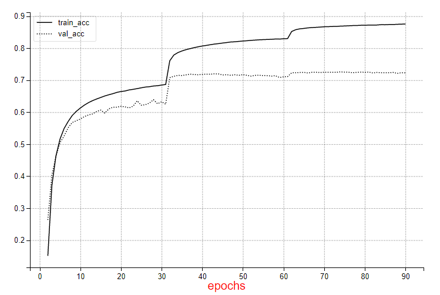

# Densenet-121
## Table Of Contents
* [Model overview](#Model-overview)
* [Setup](#Setup)
* [Training the Model](#Training-the-model)
* [Training Results](#Training-Results)

## Model overview
This code demonstrates training of the Densenet-121 model on ILSVRC2012 dataset (aka ImageNet).
The model architecture is described in this paper: https://arxiv.org/abs/1608.06993.
The implementation employs Keras.Application model (https://www.tensorflow.org/api_docs/python/tf/keras/applications/densenet). 

### Changes to the original model:
1. A generic Keras-based training script was used from here: https://github.com/jkjung-avt/keras_imagenet.
As this script was originally developed in TF-1.12, it was migrated to TF-2.2 using the automatic migration tool
provided by TensorFlow (https://www.tensorflow.org/guide/upgrade).
2. Updates on the usage of tf.contrib module were made, as these are not available in TensorFlow 2.2.
An additional change is the addition of multi card support, using
[Mirrored strategy](https://www.tensorflow.org/api_docs/python/tf/distribute/MirroredStrategy). This change only applies to non-HPU hardware.
3. `set_learning_phase(True)` - Sets the learning phase to a fixed value.
4. Setting batch size before calling `model.fit`

## Setup
### Data

The training script requires Imagenet data (ILSVRC2012) to be preprocessed into TFRecords.


### Model Setup

1. [Download](http://image-net.org/index) and [preprocess](https://gist.github.com/qfgaohao/51556faa527fba89a81d048dda37c504) the dataset.

2. Complete the Installation of the SynapseAI SW stack if needed.  Users can refer to the [Habana Installation Guide](https://docs.habana.ai/projects/SynapeAI-Gaudi/en/latest/Installation_Guide/GAUDI_Installation_Guide.html)

3. Download docker ---
```
 sudo docker pull vault.habana.ai/gaudi-docker/0.13.0/ubuntu18.04/habanalabs/tensorflow-installer:0.13.0-380
```
4. Run docker ---
**NOTE:** This assumes Imagenet dataset is under /opt/datasets/imagenet on the host. Modify accordingly.
```
docker run -td --device=/dev/hl_controlD0:/dev/hl_controlD0 --device=/dev/hl_controlD1:/dev/hl_controlD1 --device=/dev/hl_controlD2:/dev/hl_controlD2 --device=/dev/hl_controlD3:/dev/hl_controlD3 --device=/dev/hl_controlD4:/dev/hl_controlD4 --device=/dev/hl_controlD5:/dev/hl_controlD5 --device=/dev/hl_controlD6:/dev/hl_controlD6 --device=/dev/hl_controlD7:/dev/hl_controlD7 --device=/dev/hl0:/dev/hl0 --device=/dev/hl1:/dev/hl1 --device=/dev/hl2:/dev/hl2 --device=/dev/hl3:/dev/hl3 --device=/dev/hl4:/dev/hl4 --device=/dev/hl5:/dev/hl5 --device=/dev/hl6:/dev/hl6 --device=/dev/hl7:/dev/hl7 -e DISPLAY=$DISPLAY -e LOG_LEVEL_ALL=6 -v /sys/kernel/debug:/sys/kernel/debug -v /tmp/.X11-unix:/tmp/.X11-unix:ro -v /tmp:/tmp -v /opt/datasets/imagenet:/root/tensorflow_datasets/imagenet --net=host --ulimit memlock=-1:-1 vault.habana.ai/gaudi-docker/0.13.0/ubuntu18.04/habanalabs/tensorflow-installer:0.13.0-380
```
OPTIONAL with mounted shared folder to transfer files out of docker:
```
docker run -td --device=/dev/hl_controlD0:/dev/hl_controlD0 --device=/dev/hl_controlD1:/dev/hl_controlD1 --device=/dev/hl_controlD2:/dev/hl_controlD2 --device=/dev/hl_controlD3:/dev/hl_controlD3 --device=/dev/hl_controlD4:/dev/hl_controlD4 --device=/dev/hl_controlD5:/dev/hl_controlD5 --device=/dev/hl_controlD6:/dev/hl_controlD6 --device=/dev/hl_controlD7:/dev/hl_controlD7 --device=/dev/hl0:/dev/hl0 --device=/dev/hl1:/dev/hl1 --device=/dev/hl2:/dev/hl2 --device=/dev/hl3:/dev/hl3 --device=/dev/hl4:/dev/hl4 --device=/dev/hl5:/dev/hl5 --device=/dev/hl6:/dev/hl6 --device=/dev/hl7:/dev/hl7 -e DISPLAY=$DISPLAY -e LOG_LEVEL_ALL=6 -v /sys/kernel/debug:/sys/kernel/debug -v /tmp/.X11-unix:/tmp/.X11-unix:ro -v /tmp:/tmp -v ~/shared:/root/shared -v /opt/dataset/imagenet:/root/tensorflow_datasets/imagenet --net=host --ulimit memlock=-1:-1 vault.habana.ai/gaudi-docker/0.13.0/ubuntu18.04/habanalabs/tensorflow-installer:0.13.0-380
```
5. Check name of your docker
```
docker ps
```
6. Run bash in your docker
```
docker exec -ti <NAME> bash
```

## Training the Model
1. `train.py --dataset_dir <path TFRecords dataset>`
2. `train.py --dataset_dir <path TFRecords dataset> --only_eval <path to saved model>`

Step 1 will save the trained model after each epoch under `saves`

The following params are default:
1. `--dropout_rate`: 0.0 (no dropout)
2. `--weight_decay`: 1e-4
3. `--optimizer`: sgd
4. `--batch_size`: 64
5. `--lr_sched`: steps
6. `--initial_lr`: 5e-2
7. `--final_lr`: 1e-5
8. `--bfloat16`: True
9. `--epochs`: 90


## Training Results:

Training achieved 71.9% validation accuracy.

### Performance:
Batch size 64, Bfloat16:  687 Images per second
Batch size 128, Bfloat16:  770 Images per second



