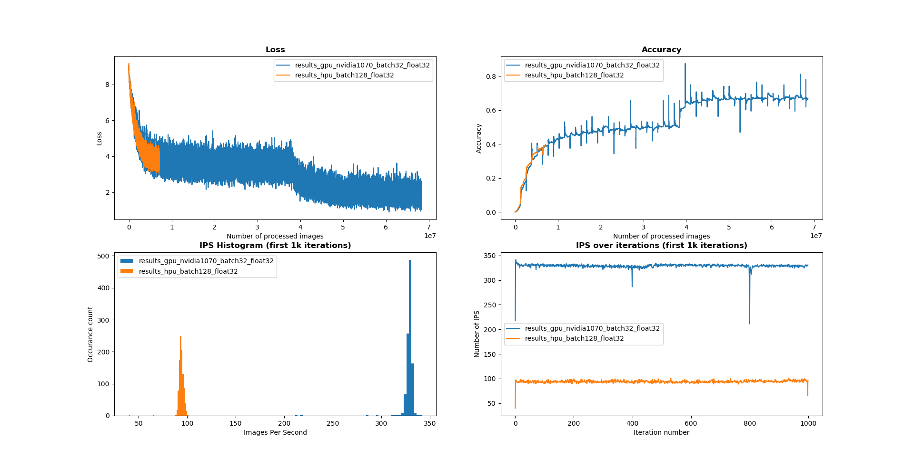

# Plotting Resnet50 results

## Requirements

The only requirement is **Matplotlib** (``pip install matplotlib``).

## Plotting

In order to plot the results, one must first have them (Duh...).

1. Run training and dump results to a file:
```bash
python3 <path_to_repo>/tensorflow-training/demo/resnet/imagenet_main.py --num_gpus=1 --data_dir /software/data/tf/data/imagenet/tf_records/ --distribution_strategy=off --batch_size=32 &> results_float32_batch32.txt
```

2. Run the script to plot results:
```bash
# Generic usage:
python plot_results_resnet50.py <batch_size1> <file_name1> <batch_size2> <file_name2> ...

# Specific for the case above:
python plot_results_resnet50.py 32 results_float32_batch32.txt
```

The output of the script is a single window with four subplots:
- Loss,
- Accuracy,
- Histogram of IPS for first 1k iterations,
- IPS for first 1k iterations.

Additionally, if you have X11 forwarding in SSH enabled (by default in MobaXterm for example), you can run this script from command line on vm and it will open dialogue with graphs in Windows.

**Comparison: GPU batch32 vs HPU batch128:**


