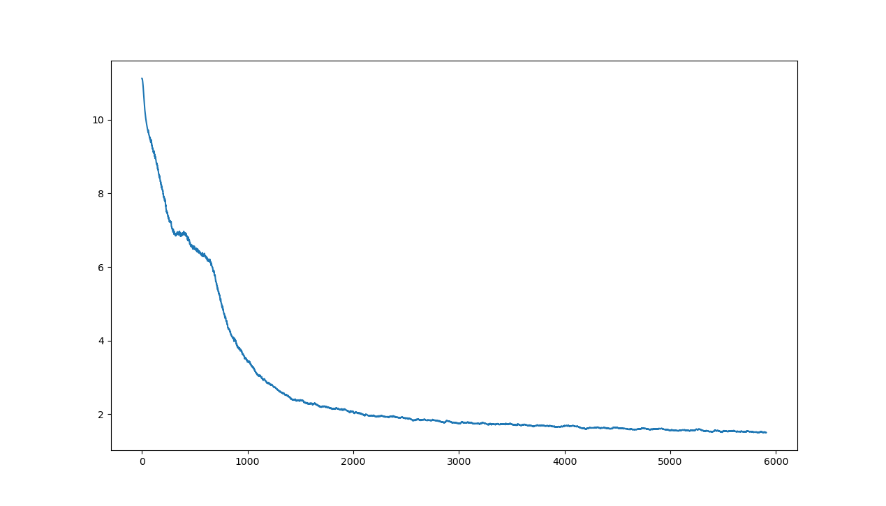

# BERT

**Table of Contents**
* [Model Overview](#model-overview)
* [BERT Pre-Training](#bert-pre-training)
* [BERT Fine-Tuning](#bert-fine-tuning)
* [Training the Model](#training-the-model)
* [Training Results](#training-results)
* [Known Issues](#known-issues)
* [Preview of TensorFlow BERT Python scripts with yaml configuration of parameters](#preview-of-tensorflow-bert-python-scripts-with-yaml-configuration-of-parameters)

## Model Overview

Bidirectional Encoder Representations from Transformers (BERT) is a technique for natural language processing (NLP) pre-training developed by Google.
BERT was created and published in 2018 by Jacob Devlin and his colleagues from Google.
Google is leveraging BERT to better understand user searches.

The original English-language BERT model comes with two pre-trained general types: (1) the BERTBASE model, a 12-layer, 768-hidden, 12-heads, 110M parameter neural network architecture, and (2) the BERTLARGE model, a 24-layer, 1024-hidden, 16-heads, 340M parameter neural network architecture; both of which were trained on the BooksCorpus with 800M words, and a version of the English Wikipedia with 2,500M words.

There are 2 distinct sets of scripts for exercising BERT training:
- Pre-training: Habana modified the scripts taken from [NVidia Github](https://github.com/NVIDIA/DeepLearningExamples/tree/master/TensorFlow/LanguageModeling/BERT). For the details on changes, go to [pretraining-changes.md](./pretraining-changes.md)
- Fine-tuning: Habana modified the scripts taken from [Google Github](https://github.com/google-research/bert). For the details on changes, go to [finetuning-changes.md](./finetuning-changes.md)

## BERT Pre-Training
- Located in: `Model-References/Tensorflow/nlp/bert/pretaining`
- Suited for datasets:
  - `bookswiki`
  - `overfit`
- Uses optimizer: **LAMB** ("Layer-wise Adaptive Moments optimizer for Batch training").
- Consists of 2 phases:
  - Phase 1 - **Masked Language Model** - where given a sentence, a randomly chosen word is guessed.
  - Phase 2 - **Next Sentence Prediction** - where the model guesses whether sentence B comes after sentence A
- The resulting (trained) model weights are language-specific (here: english) and has to be further "fitted" to do a specific task (with finetuning).
- Heavy-weight: the training takes several hours or days.
- Get the Habana TensorFlow docker image:
```
  docker pull vault.habana.ai/gaudi-docker/0.13.0/ubuntu18.04/habanalabs/tensorflow-installer:0.13.0-380
```
- Run the docker container:
```
  docker run -it -v /dev:/dev --device=/dev:/dev -e OMPI_MCA_btl_vader_single_copy_mechanism=none --cap-add=sys_nice -v /sys/kernel/debug:/sys/kernel/debug --net=host vault.habana.ai/gaudi-docker/0.13.0/ubuntu18.04/habanalabs/tensorflow-installer:0.13.0-380
```
- In the docker container:
```
  git clone https://github.com/HabanaAI/Model-References
  cd Model-References/TensorFlow/nlp/bert/
```
- Download and preprocess the datasets for pre-training:

In `Model-References/TensorFlow/nlp/bert/data` folder, we provide scripts to download, extract and preprocess [Wikipedia](https://dumps.wikimedia.org/) and [BookCorpus](http://yknzhu.wixsite.com/mbweb) datasets.
To run the scripts, set Python 3.6 as default Python in the container, go to `data` folder and install required Python packages:

```bash
ln -s /usr/bin/python3.6 /usr/bin/python
cd data
pip install boto3 ipdb html2text nltk progressbar filelock tokenizers==0.7.0
```

The pretraining dataset is 170GB+ and takes 15+ hours to download. The BookCorpus server most of the times get overloaded and also contain broken links resulting in HTTP 403 and 503 errors. Hence, it is recommended to skip downloading BookCorpus with the script by running:

```
bash create_datasets_from_start.sh
```
Users are welcome to download BookCorpus from other sources to match our accuracy, or repeatedly try our script until the required number of files are downloaded by running the following:

```
bash create_datasets_from_start.sh wiki_books
```
## BERT Fine-Tuning
- Located in: `Model-References/TensorFlow/nlp/bert`
- Suited for tasks:
  - `mrpc`: Microsoft Research Paraphrase Corpus (**MRPC**) is a paraphrase identification dataset, where systems aim to identify if two sentences are paraphrases of each other.
  - `squad`: Stanford Question Answering Dataset (**SQuAD**) is a reading comprehension dataset, consisting of questions posed by crowdworkers on a set of Wikipedia articles, where the answer to every question is a segment of text, or span, from the corresponding reading passage, or the question might be unanswerable.
- Uses optimizer: **AdamW** ("ADAM with Weight Decay Regularization").
- Based on model weights trained with pretraining.
- Light-weight: the training takes a minute or so.
- Datasets for MRPC and SQuAD will be automatically downloaded the first time the model is run in the docker container.

- Get the Habana TensorFlow docker image:
```
  docker pull vault.habana.ai/gaudi-docker/0.13.0/ubuntu18.04/habanalabs/tensorflow-installer:0.13.0-380
```

- Run the docker container:
```
  docker run -it -v /dev:/dev --device=/dev:/dev -e OMPI_MCA_btl_vader_single_copy_mechanism=none --cap-add=sys_nice -v /sys/kernel/debug:/sys/kernel/debug --net=host vault.habana.ai/gaudi-docker/0.13.0/ubuntu18.04/habanalabs/tensorflow-installer:0.13.0-380
```

- In the docker container:

```
  git clone https://github.com/HabanaAI/Model-References
  cd Model-References/TensorFlow/nlp/bert/
```

## Training the Model

If `Model-References` repository path is not in the PYTHONPATH, make sure you update it:
```bash
export PYTHONPATH=/path/to/Model-References:$PYTHONPATH
```

Set the pre-training dataset location as follows if you run BERT pre-training:
```bash
export INPUT_FILES_PREFIX=/path/to/pre-train/dataset
```

To see the full list of available options and the descriptions, run:
```bash
./demo_bert -h  # for help
```

### Examples

The following table provides command lines to run the training under various configurations.

| Model        | Task & Dataset            | # Gaudi cards, Batch Size, Seq Length, Precision     | Command Line           |
|:----------------|-----------------|:------------------------:|:--------------------------------------------------|
| BERT Base   | Fine-Tuning for MRPC                     | 1-card, BS=64, Seq=128, bf16                        | `./demo_bert -d bf16 finetuning -m base -t mrpc -b 64 -s 128`   |
| BERT Base   | Fine-Tuning for SQuAD                     | 1-card, BS=64, Seq=128, bf16                        | `./demo_bert -d bf16 finetuning -m base -t squad -b 64 -s 128`   |
| BERT Base  | Fine-Tuning for MRPC                     | 8-cards, BS=64, Seq=128, bf16                        | `./demo_bert -v -d bf16 finetuning -m base -t mrpc -b 64 -s 128`   |
| BERT Base  | Fine-Tuning for SQuAD                     | 8-cards, BS=64, Seq=128, bf16                        | `./demo_bert -v -d bf16 finetuning -m base -t squad -b 64 -s 128`   |
| BERT Large   | Fine-Tuning for MRPC                     | 1-card, BS=64, Seq=128, bf16                        | `./demo_bert -d bf16 finetuning -m large -t mrpc -b 64 -s 128`   |
| BERT Large   | Fine-Tuning for SQuAD                     | 1-card, BS=64, Seq=128, bf16                        | `./demo_bert -d bf16 finetuning -m large -t squad -b 64 -s 128`   |
| BERT Large  | Fine-Tuning for MRPC                     | 8-cards, BS=64, Seq=128, bf16                        | `./demo_bert -v -d bf16 finetuning -m large -t mrpc -b 64 -s 128`   |
| BERT Large  | Fine-Tuning for SQuAD                     | 8-cards, BS=64, Seq=128, bf16                        | `./demo_bert -v -d bf16 finetuning -m large -t squad -b 64 -s 128`   |

Keep an eye on the opening log messages, as they show variables, which can be overridden by the environment. For instance, if you want to enable ART in HCL, just:
```bash
HABANA_USE_PREALLOC_BUFFER_FOR_ALLREDUCE=false ./demo_bert ...
```

Or to enable profiling with Synapse traces with SynapseLoggerHook:
```bash
HABANA_SYNAPSE_LOGGER=range ./demo_bert ...
```

## Training Results

#### Pre-training

The following performance and accuracy results were obtained by pre-training Wikipedia and BookCorpus datasets on Gaudi cards with Habana TensorFlow-Installer 0.13.0-380 container.

| Model        | # Gaudi Cards     | Precision | Batch Size: Phase1, Phase2 | Seq Length: Phase1, Phase2  | Command Line           |  Throughput (Sequences/Sec): Phase1, Phase2 |  Time to Train (Hrs)  |  Final Loss  |
|:----------------|-----------------|----------|-------------------|:-----------------|:---------------------------|:--------------|:------------:|:------------:|
| BERT Large | 1-card | bf16 | 64, 8 | 128, 512 | `./demo_bert -d bf16 pretraining -m large -t bookswiki -b 64 8` | 162 sps, 30 sps | TBD | TBD |
| BERT Large | 1-card | fp32 | 32, 8 | 128, 512 | `./demo_bert -d fp32 pretraining -m large -t bookswiki -b 32 8` | 52 sps, 11 sps | TBD | TBD |
| BERT Large | 8-cards | bf16 | 64, 8 | 128, 512 | `./demo_bert -v -d bf16 pretraining -m large -t bookswiki -b 64 8` | 1164 sps, 244 sps | TBD | 1.53 after 5980 / 7038 in phase 1 |

#### Bert Large on 8-cards loss


#### Fine-tuning

The following performance and accuracy results were obtained by fine-tuning pre-trained BERT model with MRPC and SQuAD datasets on Gaudi cards with Habana TensorFlow-Installer 0.13.0-380 container.

| Model        | Dataset            | # Gaudi cards, Batch Size, Seq Length, Precision     | Command Line           |  Throughput (Sequences/Sec)  |Time to Train (Hrs)  |  Accuracy  |
|:----------------|---------------|:------------------------:|:--------------------------------------------------|:-------------------|:-------------------:|------------:|
| BERT Base   | MRPC             | 1-card, BS=32, Seq=128, bf16              | `./demo_bert -d bf16 finetuning -m base -t mrpc -b 32 -s 128`   | 435 sps | TBD | TBD |
| BERT Base   | MRPC             | 1-card, BS=32, Seq=128, fp32              | `./demo_bert -d fp32 finetuning -m base -t mrpc -b 32 -s 128`   | 165 sps | TBD | TBD |
| BERT Base   | SQuAD            | 1-card, BS=32, Seq=384, bf16              | `./demo_bert -d bf16 finetuning -m base -t squad -b 32 -s 384`  | 138 sps | TBD | TBD |
| BERT Base   | SQuAD            | 1-card, BS=32, Seq=384, fp32              | `./demo_bert -d fp32 finetuning -m base -t squad -b 32 -s 384`  | 55 sps | TBD | TBD |
| BERT Large  | MRPC             | 1-card, BS=64, Seq=128, bf16              | `./demo_bert -d bf16 finetuning -m large -t mrpc -b 64 -s 128`  | 173 sps | TBD | TBD |
| BERT Large  | MRPC             | 1-card, BS=32, Seq=128, fp32              | `./demo_bert -d fp32 finetuning -m large -t mrpc -b 32 -s 128`  | 55 sps | TBD | TBD |
| BERT Large  | SQuAD            | 1-card, BS=24, Seq=384, bf16              | `./demo_bert -d bf16 finetuning -m large -t squad -b 24 -s 384` | 48 sps | TBD | 93% |
| BERT Large  | SQuAD            | 1-card, BS=10, Seq=384, fp32              | `./demo_bert -d fp32 finetuning -m large -t squad -b 10 -s 384` | 17 sps | TBD | TBD |
| BERT Base   | SQuAD            | 8-cards, BS=32, Seq=384, bf16             | `./demo_bert -v -d bf16 finetuning -m base -t squad -b 32 -s 384`   | 1050 sps | TBD | 88% |
| BERT Large  | SQuAD           | 8-cards, BS=24, Seq=384, bf16              | `./demo_bert -v -d bf16 finetuning -m large -t squad -b 24 -s 384`   | 349 sps | TBD | 93% |
| BERT Large  | SQuAD           | 16-cards, BS=24, Seq=384, bf16              | `./demo_bert -v -d bf16 finetuning -m large -t squad -b 24 -s 384`   | 603 sps | TBD | 92% |

## Known Issues

The following configurations are known to have issues that are being investigated.

| Model        | Task & Dataset            | # Gaudi cards, Batch Size, Seq Length, Precision     | Command Line           |
|:----------------|-----------------|:------------------------:|:--------------------------------------------------|
| BERT Large  | Fine-Tuning for MRPC                     | 1-card, BS=64, Seq=384, fp32                        | `./demo_bert -d fp32 finetuning -m large -t mrpc -b 64 -s 384`   |
| BERT Large   | Fine-Tuning for MRPC                     | 1-card, BS=64, Seq=384, bf16                        | `./demo_bert -d bf16 finetuning -m large -t mrpc -b 64 -s 384`   |
| BERT Large   | Fine-Tuning for SQuAD                     | 1-card, BS=24, Seq=384, fp32                        | `./demo_bert -d fp32 finetuning -m large -t squad -b 24 -s 384`   |
| BERT Large   | Fine-Tuning for SQuAD                     | 1-card, BS=64, Seq=384, fp32                        | `./demo_bert -d fp32 finetuning -m large -t squad -b 64 -s 384`   |
| BERT Large   | Fine-Tuning for SQuAD                     | 1-card, BS=64, Seq=384, bf16                        | `./demo_bert -d bf16 finetuning -m large -t squad -b 64 -s 384`   |
| BERT Large   | Fine-Tuning for MRPC                     | 8-cards, BS=24, Seq=384, fp32                        | `./demo_bert -v -d fp32 finetuning -m large -t mrpc -b 24 -s 384`   |
| BERT Large   | Fine-Tuning for MRPC                     | 8-cards, BS=64, Seq=384, fp32                        | `./demo_bert -v -d fp32 finetuning -m large -t mrpc -b 64 -s 384`   |
| BERT Large  | Fine-Tuning for MRPC                     | 8-cards, BS=64, Seq=384, bf16                        | `./demo_bert -v -d bf16 finetuning -m large -t mrpc -b 64 -s 384`   |
| BERT Large  | Fine-Tuning for SQuAD                     | 8-cards, BS=24, Seq=384, fp32                        | `./demo_bert -v -d fp32 finetuning -m large -t squad -b 24 -s 384`   |
| BERT Large  | Fine-Tuning for SQuAD                     | 8-cards, BS=64, Seq=384, fp32                        | `./demo_bert -v -d fp32 finetuning -m large -t squad -b 64 -s 384`   |
| BERT Large  | Fine-Tuning for SQuAD                     | 8-cards, BS=64, Seq=384, bf16                        | `./demo_bert -v -d bf16 finetuning -m large -t squad -b 64 -s 384`   |
| BERT Large | Pre-Training on BookCorpus and Wikipedia | 8-cards, BS=64, Seq=128, fp32 | `./demo_bert -v -d fp32 pretraining -m large -t bookswiki -b 64 8`   |

## Preview of TensorFlow BERT Python scripts with yaml configuration of parameters

Habana Model-References now has support for single-card and 8-cards BERT training run through Python scripts starting with the 0.13 release. Additionally, the models will have a common look-and-feel in the Python command-line user interface to launch training. A new **Model-References/TensorFlow/habana_model_runner.py** script is used to launch BERT training in 0.13.

The **Model-References/TensorFlow/nlp/bert** repo has a new **demo_bert.py** and additional Python scripts for running BERT training. It also has two **yaml configuration files** that take care of specifying the BERT model variant name (base/large), the sub-command name (finetuning/pretraining), all of the hyperparameters associated with the model, parameters for the training run and dataset; as well as environment variables:

- **bert_base_default.yaml**
- **bert_large_default.yaml**

The user can edit these yaml files and create different versions that represent frequently run configurations, e.g. one for running BERT Large "finetuning" with "mrpc", another for running "pretraining" with "bookswiki", etc. Instead of calling **demo_bert.py** to run the model, training is now invoked via the **habana_model_runner.py** Python script that requires two parameters:

- **--model** ***model_name***
- **--hb_config** ***path_to_yaml_config_file***

Furthermore, to run 8-cards training with Horovod support, these flags need to be set in the yaml config's 'parameters' section:

```
use_horovod: True

num_workers_per_hls: 8
```

## New Python command-line interface for BERT

### Get the Habana TensorFlow docker image:
```
sudo docker pull vault.habana.ai/gaudi-docker/0.13.0/ubuntu18.04/habanalabs/tensorflow-installer:0.13.0-380
```

### Run the docker container:

We will assume there is a directory "$HOME/hlogs" on the host system which we will map as a container volume "<CONTAINER'S $HOME>/hlogs". The BERT Python training examples given below re-direct stdout/stderr to a file in the container's "~/hlogs" directory. We will also assume that there is a directory "$HOME/tmp" on the host system, that contains sufficient disk space to hold the training output directories. We will map this directory as a container volume "<CONTAINER'S $HOME>/tmp".

Please substitute "<CONTAINER'S $HOME>" with the path that running "echo $HOME" in the container returns, e.g. "/home/user1" or "/root".

```
docker run -it -v /dev:/dev --device=/dev:/dev -e OMPI_MCA_btl_vader_single_copy_mechanism=none --cap-add=sys_nice -v /sys/kernel/debug:/sys/kernel/debug --net=host -v $HOME/hlogs:<CONTAINER'S $HOME>/hlogs -v $HOME/tmp:<CONTAINER'S $HOME>/tmp -v /software/data/tf/data:/software/data/tf/data -v /software/data/bert_checkpoints:/software/data/bert_checkpoints vault.habana.ai/gaudi-docker/0.13.0/ubuntu18.04/habanalabs/tensorflow-installer:0.13.0-380
```

### Run training via the new **habana_model_runner.py** script

In the docker container:

Clone the repository and go to the bert directory:
```
git clone https://github.com/HabanaAI/Model-References
cd Model-References/TensorFlow/nlp/bert/
```
Note: If the repository is not in the PYTHONPATH, make sure you update it.
```
export PYTHONPATH=/path/to/Model-References:$PYTHONPATH
```
Run BERT training:

```
cd Model-References/TensorFlow/nlp/bert

python3 ../../habana_model_runner.py --model bert --hb_config path_to_yaml_config_file

Example:

python3 ../../habana_model_runner.py --model bert --hb_config bert_base_default.yaml >& ~/hlogs/bert_base_finetuning_mrpc_bf16.txt
```

In 0.13 the Python-cum-yaml UI is supported for running:

- single-card and 8-cards pretraining of BERT Base and BERT Large with Books & Wiki and Overfit datasets, and
- single-card and 8-cards finetuning of BERT Base and BERT Large with MRPC and SQuAD datasets
