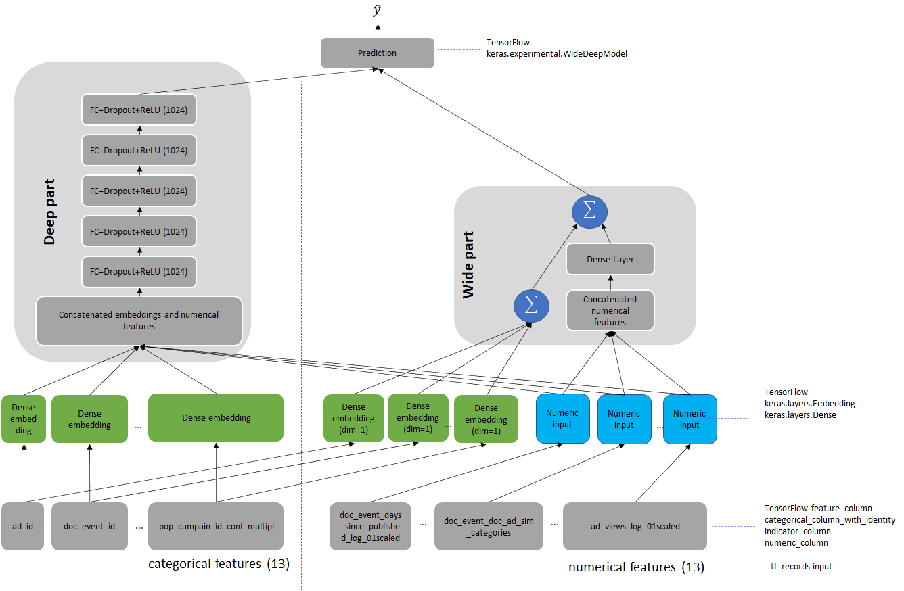

# Wide and Deep Recommender for TensorFlow

This repository provides a script and recipe to train the Wide and Deep Recommender model to achieve state-of-the-art accuracy, and is tested and maintained by Habana. For further information on performance, refer to [Habana Model Performance Data page](https://developer.habana.ai/resources/habana-training-models/#performance).

For more information on training deep learning models using Gaudi, refer to [developer.habana.ai](https://developer.habana.ai/resources/).

## Table of Contents

- [Model-References](../../../README.md)
- [Model Overview](#Model-overview)
- [Setup](#Setup)
- [Training and Examples](#Training-and-examples)
- [Advanced](#Advanced)
- [Supported Configuration](#supported-configuration)
- [Changelog](#Changelog)


## Model Overview

This repository is based on [NVIDIA's Wide & Deep Recommender for TensorFlow 2](https://github.com/NVIDIA/DeepLearningExamples/tree/88e5298421453d69e9683e970bc7b5e97fa48c3b/TensorFlow2/Recommendation/WideAndDeep). For further details on the major changes applied to the model, refer to [Changelog](#Changelog) section.

Recommendation systems drive engagement on many of the most popular online platforms. As the volume of data available to power these systems grows exponentially, Data Scientists are increasingly turning from more traditional machine learning methods to highly expressive deep learning models to improve the quality of their recommendations.

Google's [Wide & Deep Learning for Recommender Systems](https://arxiv.org/abs/1606.07792) has emerged as a popular model for Click Through Rate (CTR) prediction tasks thanks to its power of generalization (deep part) and memorization (wide part).

The difference between this Wide & Deep Recommender Model and the model from the [paper](https://arxiv.org/abs/1606.07792) is the model's deep part size. Originally, the fully connected part consists of three layers of 1024, 512, and 256 neurons. However, this model consists of 5 layers each of 1024 neurons.

### Model architecture

Wide & Deep refers to a class of networks that use the output of two parts working in parallel - wide model and deep model - to make a binary prediction of CTR. The wide model is a linear model of features together with their transforms. The deep model is a series of 5 hidden MLP layers of 1024 neurons. The model can handle both numerical continuous features as well as categorical features represented as dense embeddings. The architecture of the model is presented in Figure 1.

<p align="center">
  
  <br>
Figure 1. The architecture of the Wide & Deep model.</a>
</p>


### Applications and Dataset

As a reference dataset, a subset of [the features engineered](https://github.com/gabrielspmoreira/kaggle_outbrain_click_prediction_google_cloud_ml_engine) by the 19th place finisher in the [Kaggle Outbrain Click Prediction Challenge](https://www.kaggle.com/c/outbrain-click-prediction/) is used. This competition challenged competitors to predict the likelihood with which a particular ad on a website's display would be clicked on. Competitors were given information about the user, display, document, and ad in order to train their models. For further information on the data, refer to the [Data Description section](https://www.kaggle.com/c/outbrain-click-prediction/data).

### Default Model Configuration

The Outbrain Dataset is pre-processed to get features input to the model. The following are the important properties of the features and the model:

Features:
- Request Level:
    * 5 scalar numeric features `dtype=float32`
    * 8 categorical features (all INT32 `dtype`)
    * 8 trainable embeddings of (dimension, cardinality of categorical variable): (128,300000), (16,4), (128,100000), (64 ,4000), (64,1000), (64,2500), (64,300), (64,2000)
    * 8 trainable embeddings for wide part of size 1 (serving as an embedding from the categorical to scalar space for input to the wide portion of the model)

- Item Level:
    * 8 scalar numeric features `dtype=float32`
    * 5 categorical features (all INT32 `dtype`)
    * 5 trainable embeddings of dimensions (cardinality of categorical variable): 128 (250000), 64 (2500), 64 (4000), 64 (1000),64 (5000)
    * 5 trainable embeddings for wide part of size 1 (working as trainable one-hot embeddings)

Features describe both the user (Request Level features) and Item (Item Level Features).

- Model:
    * Input dimension is 26 (13 categorical and 13 numerical features)
    * Total embedding dimension is 976
    * 5 hidden layers each with size 1024
    * Total number of model parameter is ~90M
    * Output dimension is 1 (`y` is the probability of click given Request-level and Item-level features)
    * Loss function: Binary Crossentropy

For more information about feature preprocessing, go to [Dataset Pre-processing](#dataset-preprocessing) section.

#### Glossary

**Request level features** - Features that describe the person and context to which we wish to make recommendations.

**Item level features** - Features that describe those objects which we are considering recommending.

### Model Accuracy Metric

The model's accuracy is defined with the [MAP@12](https://en.wikipedia.org/wiki/Evaluation_measures_(information_retrieval)#Mean_average_precision) metric. This metric follows the way of assessing model accuracy in the original [Kaggle Outbrain Click Prediction Challenge](https://www.kaggle.com/c/outbrain-click-prediction/). In this repository, the leaked clicked ads are not taken into account since in industrial setup Data Scientists do not have access to leaked information when training the model. For more information on data leak in Kaggle Outbrain Click Prediction challenge, refer to [blogpost](https://medium.com/unstructured/how-feature-engineering-can-help-you-do-well-in-a-kaggle-competition-part-ii-3645d92282b8) by the 19th place finisher in that competition.

**NOTE:** The script also reports AUC ROC, binary accuracy, and Loss (BCE) values.

## Setup

Please follow the instructions provided in the [Gaudi Installation Guide](https://docs.habana.ai/en/latest/Installation_Guide/GAUDI_Installation_Guide.html) to set up the environment including the `$PYTHON` environment variable. The guide will walk you through the process of setting up your system to run the model on Gaudi.

### Clone Habana Model-References

In the docker container, clone this repository and switch to the branch that matches your SynapseAI version. You can run the [`hl-smi`](https://docs.habana.ai/en/latest/Management_and_Monitoring/System_Management_Tools_Guide/System_Management_Tools.html#hl-smi-utility-options) utility to determine the SynapseAI version.

```bash
git clone -b [SynapseAI version] https://github.com/HabanaAI/Model-References /root/Model-References
```

**Note:** If Model-References repository path is not in the PYTHONPATH, make sure you update it:
```bash
export PYTHONPATH=$PYTHONPATH:/root/Model-References
```

### Download the Outbrain Dataset

1. Go to the Wide & Deep directory:
```bash
cd /root/Model-References/TensorFlow/recommendation/WideAndDeep
```

2. Download the Outbrain dataset from [Kaggle](https://www.kaggle.com/c/outbrain-click-prediction/data). Requires Kaggle account.

3. Unzip the downloaded archive. For example, uzip to `/data/tensorflow/wide_and_deep/orig/`.

4. Pre-process the Outbrain dataset by using the bash `data_preprocessing.sh` script which installs all the required packages, libraries, and starts preprocessing:
```bash
bash dataset_preprocessing.sh --dataset_path <DATASET_PATH> --output_path <OUTPUT_PATH>
```
In the command line:
- `<DATASET_PATH>` is a path in which the downloaded and extracted dataset is stored;
- `<OUTPUT_PATH>` is a path in which the preprocessed data should be saved.
**For example:**
```bash
bash dataset_preprocessing.sh --dataset_path /data/tensorflow/wide_and_deep/orig/ --output_path /data/tensorflow/wide_and_deep/tfrecords/
```

### Install Model Requirements

Install all the required packages, **without their dependencies**, using pip:
```bash
$PYTHON -m pip install --no-deps -r /root/Model-References/TensorFlow/recommendation/WideAndDeep/requirements-no-deps.txt
```
**IMPORTANT:** `--no-deps` parameter prevents pip from installing GPU dependencies. Without the parameter, you may encounter errors during the model training.


## Training and Examples

### Single Card Training Examples

**Run training on 1 HPU:**
```bash
$PYTHON main.py --train_data_pattern <pattern of train data files> --eval_data_pattern <pattern of eval data files> --transformed_metadata_path <path to transformed metadata> --model_dir <path for checkpoints and tf events> --results_dir <path for dllogger output> --dtype <data type to be used during execution>
```

For example:
```bash
$PYTHON main.py --train_data_pattern "/data/tensorflow/wide_and_deep/tfrecords/train/part*" --eval_data_pattern "/data/tensorflow/wide_and_deep/tfrecords/eval/part*" --transformed_metadata_path "/data/tensorflow/wide_and_deep/tfrecords/" --model_dir /tmp/wide_and_deep --results_dir /tmp/wide_and_deep --dtype bf16
```
For more information on the supported parameters in the script, refer to [Parameters section](#Parameters).

**Run performance benchmark on 1 HPU:**

The following section describes how to run benchmarks to measure the model performance in the training mode.

To run performance benchmark on 1 HPU, run:
```bash
$PYTHON main.py --train_data_pattern <pattern of train data files> --eval_data_pattern <pattern of eval data files> --transformed_metadata_path <path to transformed metadata> --model_dir <path for checkpoints and tf events> --results_dir <path for dllogger output> --dtype <data type to be used during execution> --benchmark
```

For example:
```bash
$PYTHON main.py --train_data_pattern "/data/tensorflow/wide_and_deep/tfrecords/train/part*" --eval_data_pattern "/data/tensorflow/wide_and_deep/tfrecords/eval/part*" --transformed_metadata_path "/data/tensorflow/wide_and_deep/tfrecords/" --model_dir /tmp/wide_and_deep --results_dir /tmp/wide_and_deep --dtype bf16 --benchmark
```

The number of benchmark steps and warmup steps (subset of benchmark steps not taken into account during overall performance calculation) can be tuned with `--benchmark_steps` and `--benchmark_warmup_step` accordingly.

For more information on the supported parameters in the script, refer to [Parameters section](#Parameters).

## Advanced
The following sections provide further details of scripts in the repository, available parameters and command-line options.

### Scripts definitions
* `main.py`: The training script of the Wide & Deep recommender model, entry point to the application.
* `dataset_preprocessing.sh`: Bash script for data preprocessing of the Outbrain dataset.
* `data/outbrain/dataloader.py`: Contains data loaders for training and evaluation set.
* `data/outbrain/features.py`: Defines the request and item level features as well as embedding dimensions and hash bucket's sizes.
* `data/outbrain/spark/`: Contains preprocessing scripts with PySpark. For more information about preprocessing, go to [Dataset preprocessing](#dataset-preprocessing) section.
* `trainer/model/layers.py`: Defines different blocks that are used to assemble Wide&Deep model.
* `trainer/model/widedeep.py`: Defines the model architecture using the blocks from the `layers.py` script.
* `trainer/utils/arguments.py`: Implements the command-line arguments parsing.
* `trainer/utils/schedulers.py`: Implements learning-rate scheduler for the optimizer.
* `trainer/utils/setup.py`: Implements helper setup functions.
* `trainer/run.py`: Implements logic for training and evaluation loops.

### Parameters

The complete list of the available parameters for the `main.py` script is as follows.

Parameters for location of the dataset, checkpoints and logs:
* `--train_data_pattern`: Pattern of training file names (default: `/outbrain/tfrecords/train/part*`).
* `--eval_data_pattern`: Pattern of eval file names (default: `/outbrain/tfrecords/eval/part*`).
* `--transformed_metadata_path`: Path to transformed_metadata for feature specification reconstruction (default: `/outbrain/tfrecords`).
* `--use_checkpoint`: Use checkpoint stored in model_dir path (default: `False`).
* `--model_dir`: Destination where model checkpoint and tf events will be saved (default: `/outbrain/tfrecords`).
* `--results_dir`: Directory where dllogger output will be saved (default: `/results`).
* `--log_filename`: Name of the file to store dlloger output (default: `log.json`).

Training parameters:
* `--training_set_size`: Number of samples in the training set (default: `59761827`).
* `--global_batch_size`: Total size of training batch (default: `131072`).
* `--eval_batch_size`: Total size of evaluation batch (default: `131072`).
* `--num_epochs`: Number of training epochs (default: `20`).
* `--device`: Device to be used for computations (default: `hpu`).
* `--dtype`: Data type to be used during model execution (default: `bf16`).
* `--use_horovod`: Enable horovod usage (default: `False`).
* `--xla`: Enable XLA conversion (default: `False`).
* `--linear_learning_rate`: Learning rate for linear model (default: `0.02`).
* `--deep_learning_rate`: Learning rate for deep model (default: `0.00012`).
* `--deep_warmup_epochs`: Number of learning rate warmup epochs for deep model (default: `6`).

Model construction parameters:
* `--deep_hidden_units`: Hidden units per layer for deep model, separated by spaces (default: `1024, 1024, 1024, 1024, 1024`).
* `--deep_dropout`: Dropout regularization for deep model (default: `0.1`).

Run mode parameters
* `--evaluate`: Only perform an evaluation on the validation dataset, don't train (default: `False`).
* `--benchmark`: Run training or evaluation benchmark to collect performance metrics (default: `False`).
* `--benchmark_warmup_steps`: Number of warmup steps before start of the benchmark (default: `500`).
* `--benchmark_steps`: Number of steps for performance benchmark (default: `1000`).
* `--affinity`: Type of CPU affinity (default: `socket_unique_interleaved`).
* `--log_every`: Log data every n steps (default: `100`).

### Command-line Options

To see the full list of the available options and their descriptions, use the `-h` or `--help` command-line option:
```bash
$PYTHON main.py --help
```

### Dataset Pre-processing
Dataset pre-processing aims to create in total 26 features: 13 categorical and 13 numerical. These features are obtained from the original Outbrain dataset in preprocessing.

The original dataset is preprocessed using the scripts provided in `data/outbrain/spark`. Preprocessing is split into 3 steps: `preproc1.py`, `preproc2.py`, and `preproc3.py` that form a complete workflow. The workflow consists of the following operations:
* Separating out the validation set for cross-validation.
* Filling missing data with mode, median, or imputed values.
* Joining click data, ad metadata,  and document category, topic and entity tables to create an enriched table.
* Computing 7 click-through rates (CTR) for ads grouped by 7 features.
* Computing attribute cosine similarity between the landing page and ad to be featured on the page.
* Math transformations of the numeric features (logarithmic, scaling, binning).
* Categorizing data using hash-bucketing.
* Storing the resulting set of features in pre-batched TFRecord format.

The `preproc1-3.py` preprocessing scripts use PySpark. The `preproc1.py` script splits the data into a training set and a validation set. The `preproc2.py` script computes the click-through rates (CTR) and cosine similarities between the features. The `preproc3.py` script performs the math transformations and generates the final TFRecord files. The data in the output files is pre-batched (with the default batch size of 4096) to avoid the overhead of the TFRecord format, which otherwise is not suitable for the tabular data.
The preprocessing includes some very resource-exhaustive operations including joining tables having over 2 billions of rows. Such operations may not fit into the RAM memory, and therefore we use Spark which is well suited for handling tabular operations on large data with limited RAM. Note that the Spark job requires about 500 GB disk space and 300 GB RAM to perform the preprocessing.

For more information on Spark, refer to the [Spark documentation](https://spark.apache.org/docs/3.2.0/).

## Supported Configuration

 Device | SynapseAI Version | TensorFlow Version(s)  |
|:-----:|:-----------------:|:-----:|
| Gaudi  | 1.6.1             | 2.9.1 |
| Gaudi  | 1.6.1             | 2.8.2 |

## Changelog
### 1.6.0
* Removed usage of deprecated numpy.asscalar function.

### 1.4.0
* Added support to import horovod-fork package directly instead of using Model-References' TensorFlow.common.horovod_helpers; wrapped horovod import with a try-catch block so that the user is not required to install this library when the model is being run on a single card

### 1.3.0
Major changes done to original model from [Wide & Deep Recommender Model Training For TensorFlow 2](https://github.com/NVIDIA/DeepLearningExamples/tree/88e5298421453d69e9683e970bc7b5e97fa48c3b/TensorFlow2/Recommendation/WideAndDeep):
* Changed some scripts to run the model on Gaudi. It includes loading habana tensorflow modules.
* Removed GPU specific files (images, Dockerfiles, bash scripts).
* Removed NVTabular data preprocessing scripts which are applicable only on GPU.
* Added support for bfloat16 mixed precision has been added.
* Added further functionalities like TensorBoard performance logging and changable frequency of logging.
* Added a temporary performance workaround (`TF_ENABLE_WIDE_AND_DEEP_WA=1`) for SynapseAI.
* Deprecated function from tensorflow_transform package has been updated for tensorflow 2.4+ compatibility.
* Changed `python` or `python3` to `$PYTHON` to execute correct version based on environment setup.


